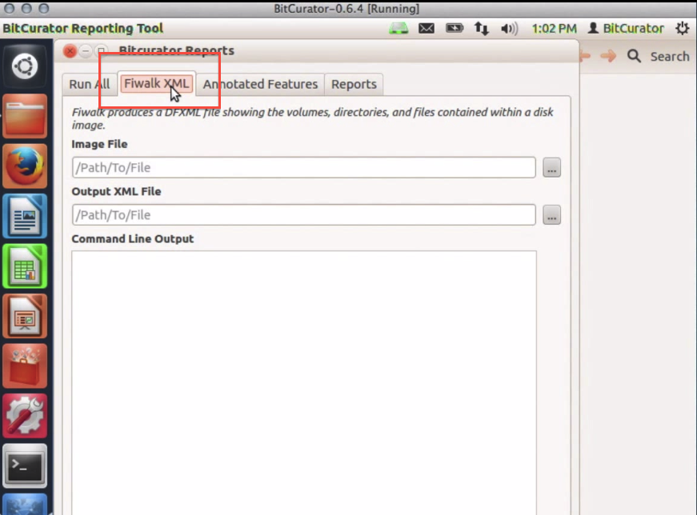
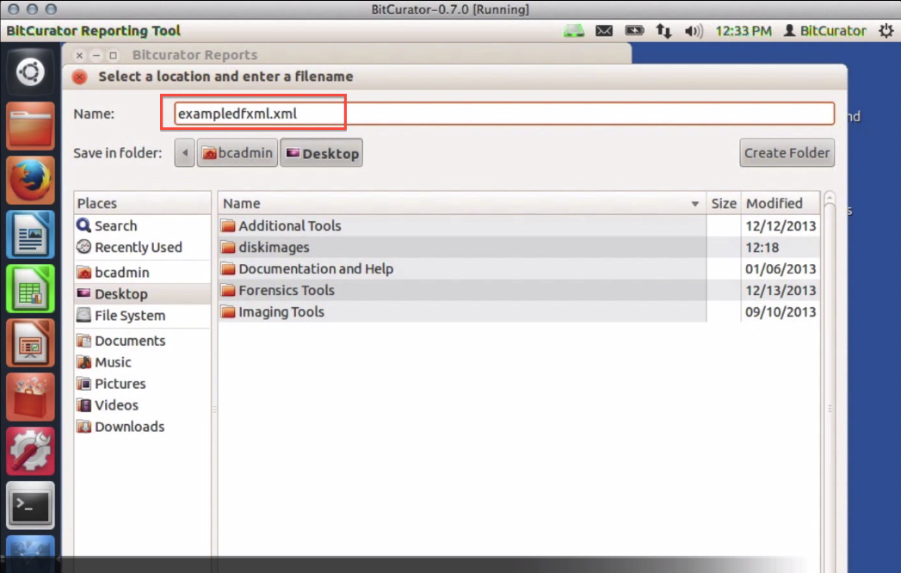
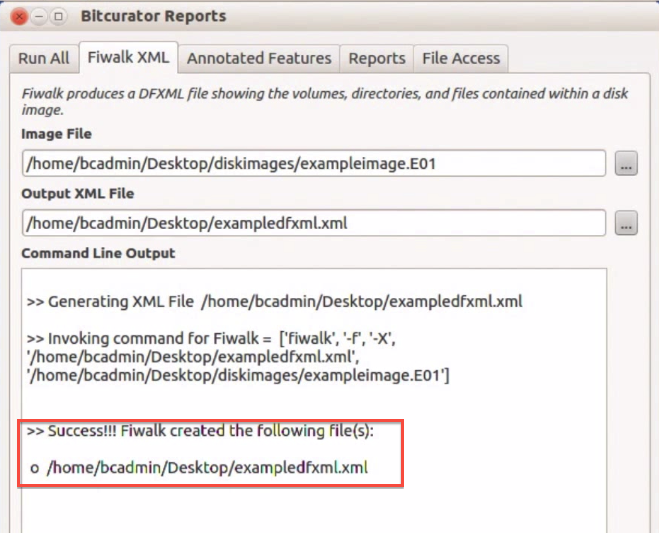
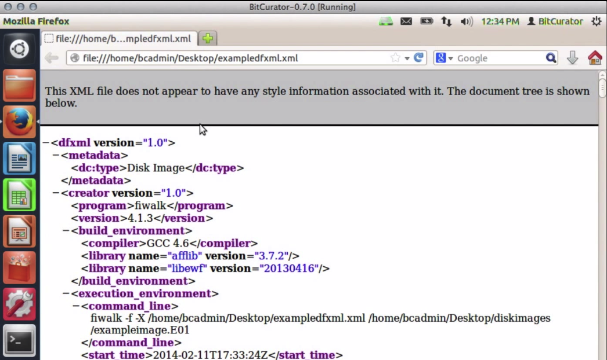

Fiwalk
======

### Overview

[Fiwalk](https://forensicswiki.xyz/wiki/index.php?title=Fiwalk) is part of [The Sleuth Kit's](http://www.sleuthkit.org/about.php) collection of digital forensics tools and is used to produce a [DFXML](https://forensicswiki.xyz/wiki/index.php?title=Category:Digital_Forensics_XML) (Digital Forensics XML) report on the contents of a disk image. As the name suggests, fiwalk "walks" the file tree and collects information (metadata) about each of the files along the way, including the date the file was last accessed, the date it was last modified, the file type, the user who created the file, and more.

Fiwalk can be run via the command line or from the BitCurator Reporting Tool. The instructions below detail the process of using fiwalk to generate DFXML output via the BitCurator Reporting Tool.

### Step-by-Step Guide

**Step 1:**Open the BitCurator Reporting Tool by double clicking on the "Forensics Tools" folder on the BitCurator desktop and then double clicking on the "BitCurator Reporting Tool" icon.

**Step 2:**Once the BitCurator Reporting Tool finishes opening, select the "Fiwalk XML" tab from the options along the top (see Figure 1).

**Step 3:**Type the location of the disk image you would like to analyze in the "Image File" field, or navigate to the image by clicking on the "..." button to the right of the field (see Figure 1).

  
***Figure 1**:*The Fiwalk XML tab in the BitCurator Reporting Tool.  
  
  

**Step 4:**Type the location and name of the DFXML file you would like to create in the "Output XML File" field or click on the "..." button to the right of the field to navigate to the directory in which you would like to create the file. The DFXML file can be named according to whatever naming conventions you are using for your collection, but it should end with a .xml extension. Once you have finished naming your DFXML file, click "Save" to return to the BitCurator Reporting Tool (see Figure 2).

*Figure 2:*  

**Step 5:**Click "Run" in the bottom right-hand corner of the BitCurator Reporting Tool and wait for fiwalk to finish analyzing the disk image. The activity bar on the bottom left will indicate that fiwalk is still running. Once fiwalk has finished, a success or error message will appear in the "Command Line Output" window (see Figure 3).

  
*Figure 3:*fiwalk has successfully create the DFXML file.  

**Step 6:**You can navigate to the DFXML file and open it with any program that handles XML display (e.g. any internet browser) to view the contents and confirm the file was created (see Figure 4).

  
*Figure 4:*View the DFXML file.  

  

 If you would like to provide feedback for this page, please follow this [link to the BitCurator Wiki Google Form](https://docs.google.com/forms/d/e/1FAIpQLSelmRx1VmgDEg3dU5_8cXZy9MZ5v8_sAl-Ur2nPFLAi6Lvu2w/viewform?usp=sf_link) for the BitCurator All Step-by-Step Guides section.

