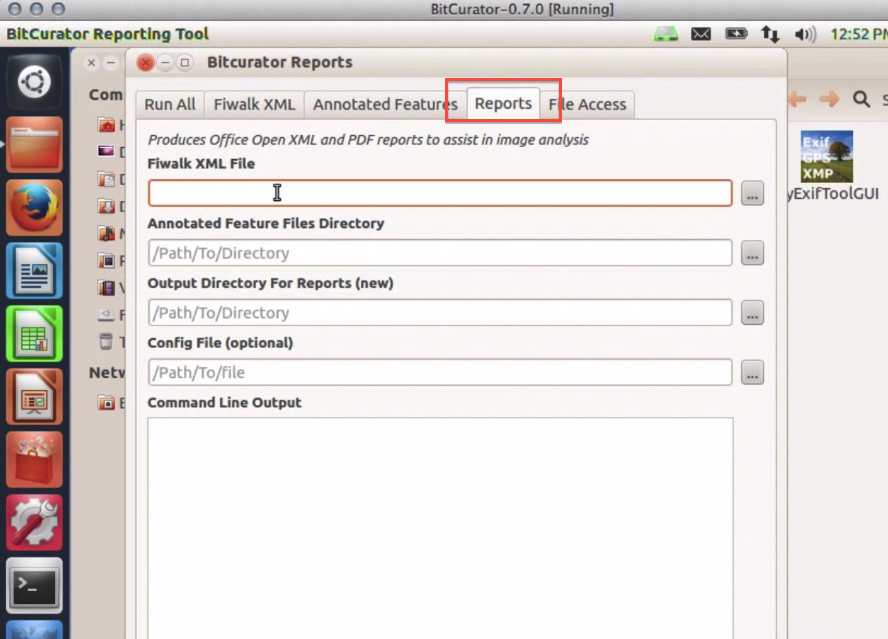
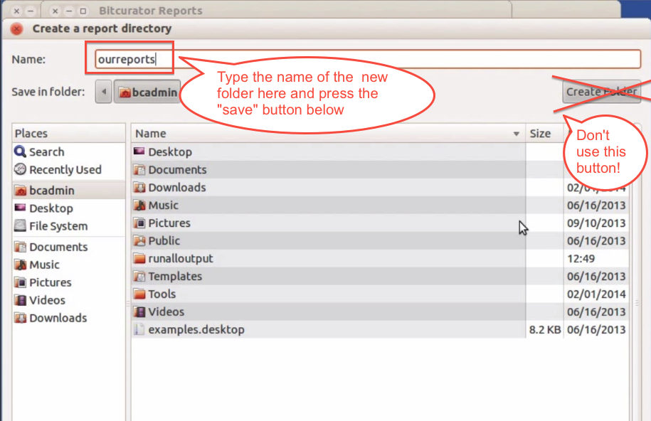
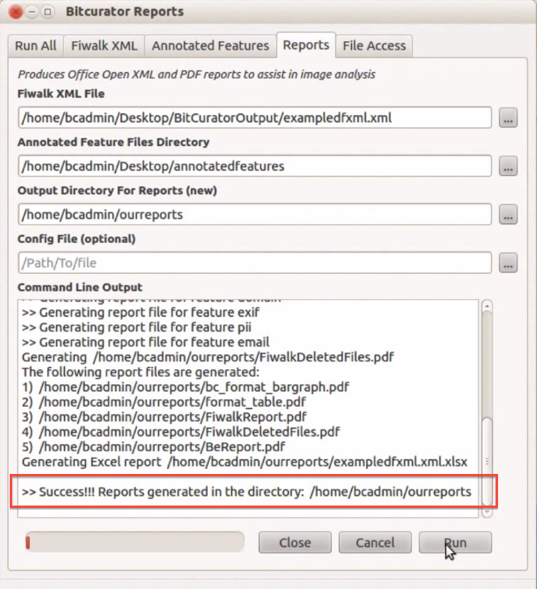

Forensic Reports
================

### Overview

The culmination of the previous steps in the BitCurator process result in the BitCurator Forensic Reports. These reports bring together the various outputs from bulk\_extractor, fiwalk and the annotation tool to generate both machine and human readable reports that can be read directly or crosswalked to other archival tools.

### Step-by-Step Guide

1. Open the BitCurator Reporting Tool by double clicking on the "Forensics Tools" folder on the BitCurator desktop and then double clicking on the "BitCurator Reporting Tool" icon.
2. Once the BitCurator Reporting Tool finishes opening, select the "Reports" tab from the options along the top (see Figure 1).
3. Type or navigate to the location of the following files or directories (see Figure 1):

	1. Fiwalk XML File: The location of the DFXML output from [running fiwalk](/documentation/BitCurator Environment/All Step-by-Step Guides/Forensics and Reporting Guides/Fiwalk).
	2. Annotated Features Files Directory: The directory containing the output from the [Annotated Features report](/documentation/BitCurator Environment/All Step-by-Step Guides/Forensics and Reporting Guides/Annotated Features Report)
	3. Output Directory For Reports (new): A new directory created by the BitCurator Reporting Tool to contain the BitCurator forensics reports. *Note*: if you use the navigation button to select this directory, type the name of the new directory in the "Name:" field on the top left of the window. Do not use the "Create Folder" button on the right to create this new directory. (see Figure 2).
	4. Config File (optional): For additional configuration files; generally left empty.  
	  
	**Figure 1**: The Reports tab in the BitCurator Reporting Tool.  
	  
	  
	**Figure 2**: Type the name of the new directory in the "Name" field.  
	
4. Once each of the file and directory fields above are properly filled out, click the "Run" button. The activity bar on the bottom left will indicated that the report generation process is still ongoing. Once complete, a success or error message will appear in the "Command Line Output" window (see Figure 3).

**Figure 3**: The BitCurator forensics reports have been successfully created.

5. Completion of the steps above generates the following files in the directory you specified under "Output Directory" in Step 3:

 

	* features (directory): the annotated features
	* bc\_format\_bargraph.pdf (file): the format histogram
	* bulk\_extractor\_report.pdf (file): high-level overview of feature locations on disk
	* fiwalk\_deleted\_files.pdf (file): shows paths to any deleted materials found in a given partition
	* fiwalk-output.xml.xlsx (file): Excel converted DFXML output (file system metadata)
	* fiwalk\_report.pdf (file): High-level overview of file system characteristics
	* format\_table.pdf (file): Long-form file format names for formats shown in bargraph
	* premis.xml (file): PREMIS preservation metadata Open the BitCurator reports directory to examine the files. You’ll find visualizations, XLSX transcriptions of file system metadata, high-level reports on file types, and overviews of features identified by bulk\_extractor.

 If you would like to provide feedback for this page, please follow this [link to the BitCurator Wiki Google Form](https://docs.google.com/forms/d/e/1FAIpQLSelmRx1VmgDEg3dU5_8cXZy9MZ5v8_sAl-Ur2nPFLAi6Lvu2w/viewform?usp=sf_link) for the BitCurator All Step-by-Step Guides section.

