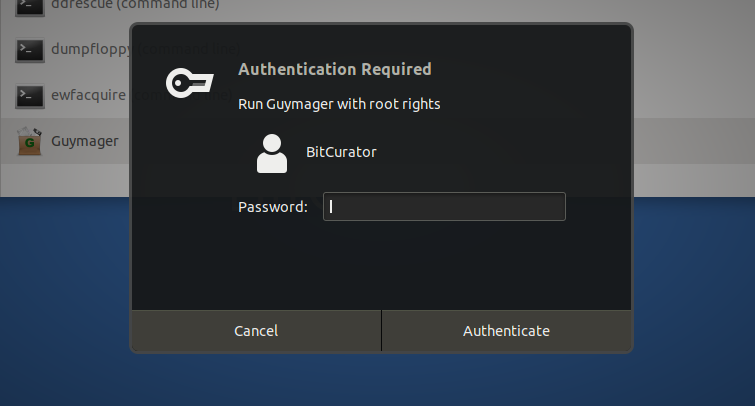
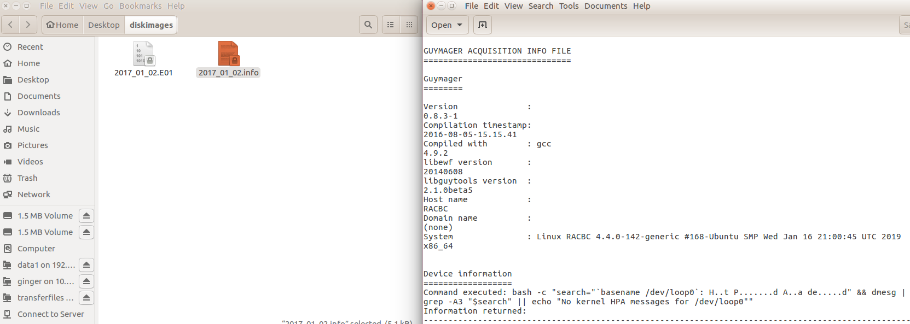

Imaging with Guymager
=====================

### **Overview**

The BitCurator environment includes [Guymager](https://guymager.sourceforge.io), an open-source, graphic application for creating disk images. Guymager supports the creation of raw (.dd) or Expert Witness Format (.E01) disk images. The Expert Witness Format is commonly used in the digital forensics community because it incorporates metadata about the original media into the disk image itself.

**Step-by-Step Guide**

**Step 1:**Create a directory to store your disk image by opening Nautilus (the "Home" folder on the top left-hand side of the screen) and right-clicking anywhere on the white background. Select "New Folder" from the drop-down menu. Name the folder as you see fit – we will use the folder name "diskimages" in this example.

**Step 2:**Connect the device you wish to image to your computer (USB flash drive, CD-ROM, hard drive, or floppy disk drive).

A device does not need to be mounted in order to be imaged by Guymager, and BitCurator will not mount devices automatically (the icon that appears in the Unity bar on the left indicates that the device is **attached**, rather than **mounted**). If you need to examine the contents of the disk before creating the disk image, you can [safely mount the device](https://confluence.educopia.org/display/BC/Safely+Mount+Devices).

**Step 3:** Open Guymager by right-clicking the icon in the "Imaging and Recovery" folder on the desktop. In the contextual menu, select "Open" (*Figure 1*).

Guymager will ask to be run with root user rights. When prompted, enter the password associated with the BitCurator user account. This is usually 'bcadmin', or it is blank if you did not enter a password during installation and setup (*Figure* *2*).

*Figure 1*: The contextual menu for opening Guymager.

*Figure 2*: Guymager prompts for authentication to allow the program root-level rights. 

**Step 4:** When Guymager launches, it will display a list of all mounted disks on the system. Select and right-click on the disk you wish to image, and select "Acquire image" (*Figure 3*).

*Figure 3:* Click on "Acquire image" to begin the imaging process.  

**Step 5:** Clicking on "Acquire Image" will open the Acquire Image window. In this window you will first select the disk image format you would like to use. The options include raw Linux dd and Expert Witness (.E01) formats. An Expert Witness image will store user-added metadata within the forensically-packaged image. 

* Guymager provides the option to split the image into multiple files, thus making it more easily transferable. So, for example, a 4 GB image could be split into four 1 GB files, or two 2 GB files, etc.

**Step 6:**After selecting the image format type, fill out the metadata as needed. 

* The Expert Witness format was designed for the digital forensics community, so metadata fields are labeled for criminal investigation. However, these fields can easily be repurposed for the needs of archivists and curators. For example, an archivist might use the "Case number" field to record an accession number.

**Step 7:** Next choose the image directory, which in this example would be "/home/bcadmin/diskimages". 

Don't create new directories from within Guymager. Instead, create new directories before launching Guymager (as described in **Step 1**). This is because Guymager runs as the root user and so any directories that it creates will require administrator permissions. 

**Step 8:**Name your disk image and choose which verification options you would like Guymager to perform. Click "OK" to begin the imaging process.

**Step 9:** Once the the imaging process begins you will see a progress bar on the main Guymager screen.

**Step 10:**After Guymager has finished creating the disk image, close Guymager and verify the image by navigating to the directory you created in Step 1. Notice that there are two files, the image itself and an info file *(Figure 4).* The info file includes the metadata we input in step 7 along with additional metadata collected during the acquisition process. The imaging process is now complete.

*Figure 4**:*Verify the disk image and metadata.  

 If you would like to provide feedback for this page, please follow this [link to the BitCurator Wiki Google Form](https://docs.google.com/forms/d/e/1FAIpQLSelmRx1VmgDEg3dU5_8cXZy9MZ5v8_sAl-Ur2nPFLAi6Lvu2w/viewform?usp=sf_link) for the BitCurator All Step-by-Step Guides section.

