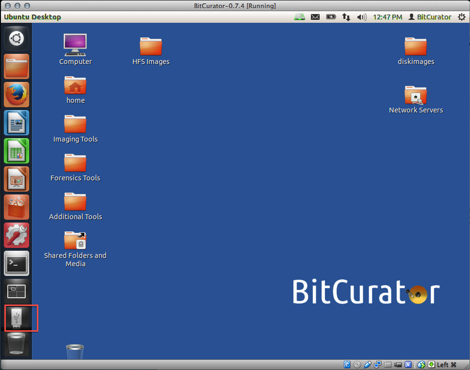
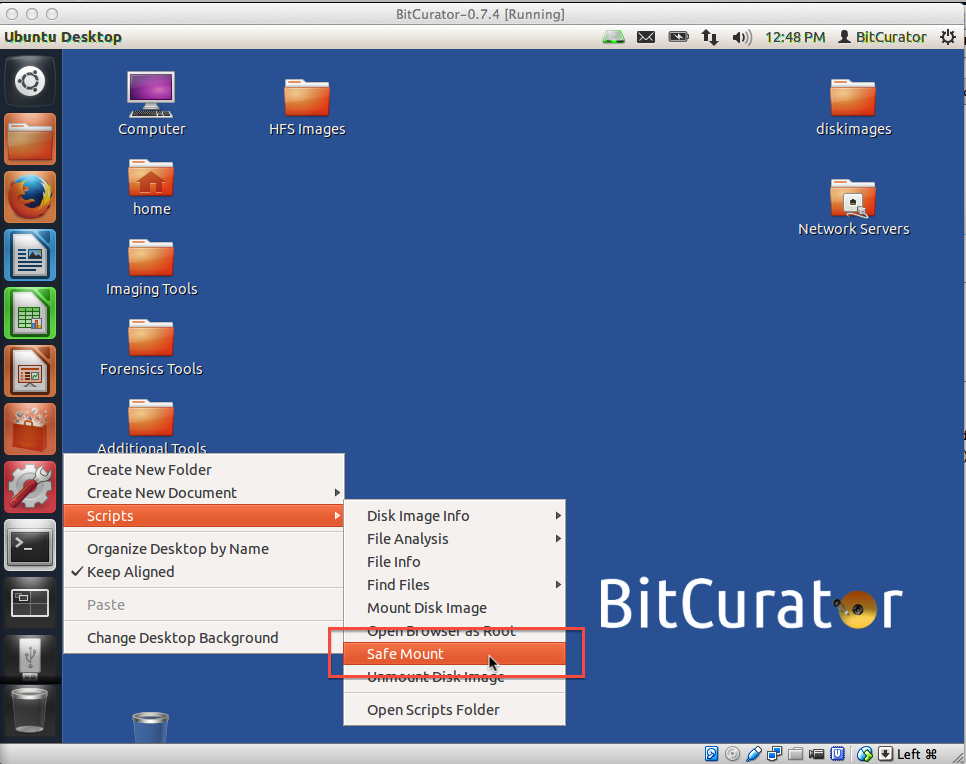
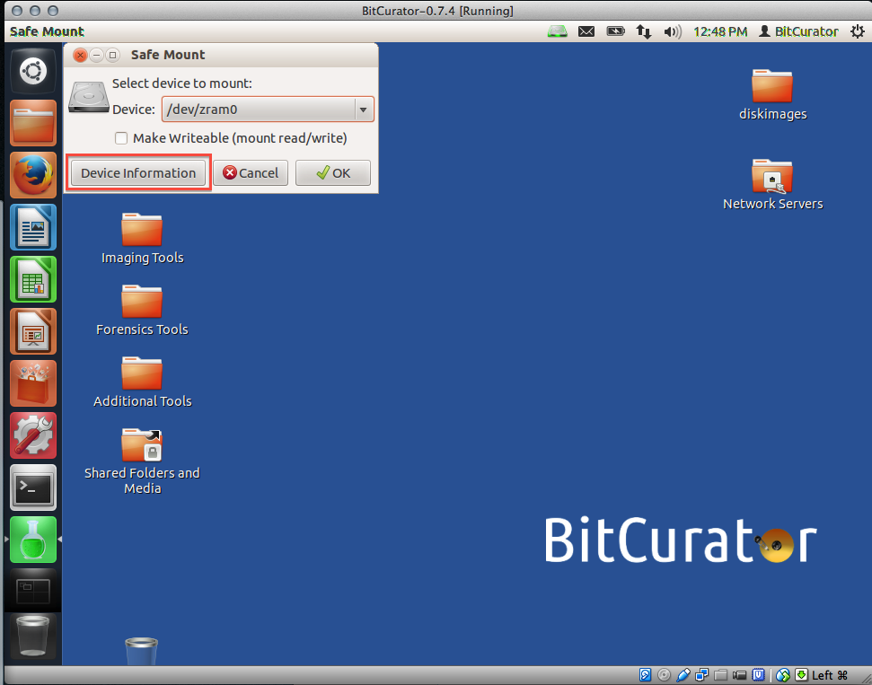
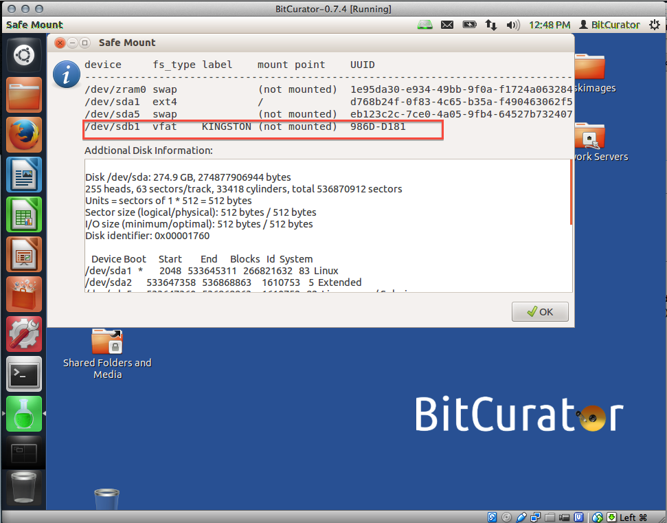
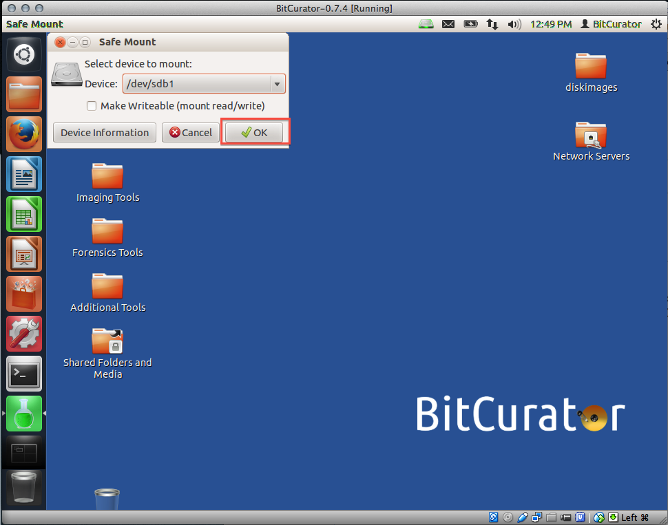
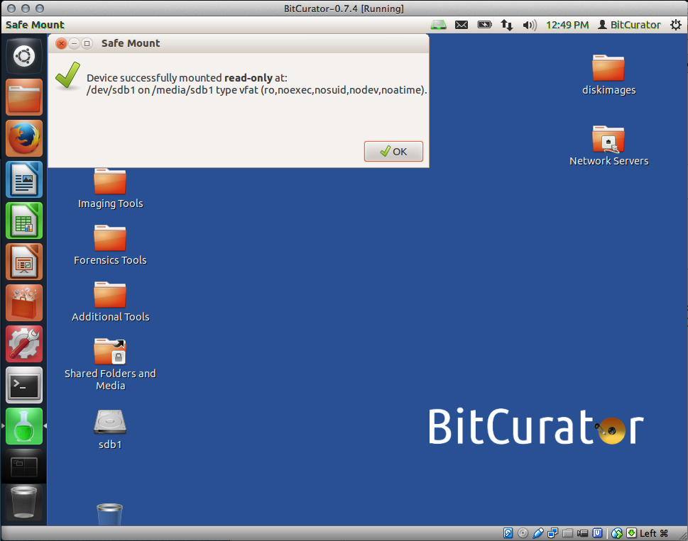

Safely Mount Devices
====================

### Overview

BitCurator's Safe Mount script allows you to view the content of a disk by mounting it with read-only access, thereby preventing any data from being inadvertently written to disk. Examples of disks might include USB thumb drives, a hard drive, or a USB-connected floppy disk drive.

The safe mount script currently supports the following file systems:

* NTFS
* Fat32
* HFS and HFS+
* ext2/3/4

***Note:***If multiple volumes are stored on a disk, the safe mount script will mount the first user volume only.

*Developer details:* This tool is a front-end for mmls and icat, two programs provided by [The Sleuth Kit](http://www.sleuthkit.org/), along with file system ID and FUSE mounting code.

### **Step-by-Step Guide**

**Step 1:** Attach your device to the computer (in our example, we've attached a USB thumb drive to the computer on which BitCurator is running). The attached device should appear as an icon in the lower left corner of the screen (see Figure 1). Right-click on that icon and choose "Scripts", then click on "Safe Mount" (see Figure 2).

*Figure 1*: Your attached device appears as an icon in the lower left of the screen.

**Step 2:** Right-click on that icon and choose "Scripts", then click on "Safe Mount" (see Figure 2).

*Figure 2**:*Navigate to the Safe Mount script.

  

**Step 3:** The Safe Mount window will open. Choose the device you wish to mount from the drop-down menu next to "Device" and click "OK".

If you are not certain which of the items in the drop-down list is your device, click on the "Device Information" button on the lower left of the window (see Figure 3).

*Figure 3*: Choose your device form the drop-down menu, or click on "Device Information" for help identifying your device.

  

This will open a window with more information about the devices available to you in the drop-down list, which should help you identify your device (see Figure 4).

In the example shown here, I used the following to identify the correct device:

* Looking at the *label* column, I recognized the USB drive's "KINGSTON" label;
* Looking at the *fs type* column, I double-checked that the listed file system type (vfat; learn more about file system types [here](http://technet.microsoft.com/en-us/library/cc750354.aspx)) matched what I knew to be the file system of the USB drive in question;
* Looking at the *mount point* column, I noted that the device is currently not mounted.

*Figure 4**:* Use the "Device Information" window to identify your device.

Once the correct device has been identified, select the device from the drop-down (see Figure 5) and click the "OK" button.

*Figure 5:* Select your device from the drop down menu.

  

**Step 4:** A pop-up message will confirm that your device has been mounted (see Figure 7).

*Figure 7**:*A pop-up message confirming the device mounting.

  

  

 If you would like to provide feedback for this page, please follow this [link to the BitCurator Wiki Google Form](https://docs.google.com/forms/d/e/1FAIpQLSelmRx1VmgDEg3dU5_8cXZy9MZ5v8_sAl-Ur2nPFLAi6Lvu2w/viewform?usp=sf_link) for the BitCurator All Step-by-Step Guides section.

