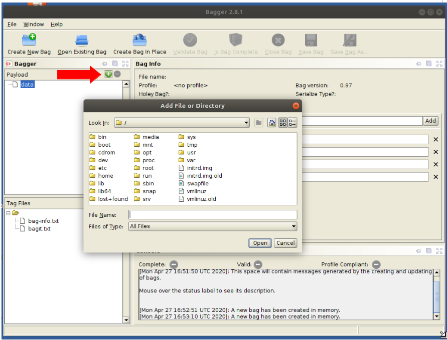
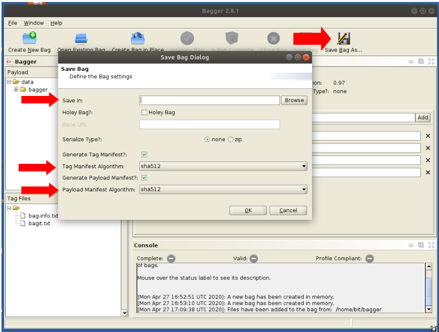

Package files and metadata with Bagger
======================================

Bagger is no longer included in the BitCurator Environment. It can still be installed in the environment - see the [project website](https://github.com/LibraryOfCongress/bagger) for more details.

  

**Overview:**

The [Bagger software](https://github.com/LibraryOfCongress/bagger) from the Library of Congress, provides a GUI application for creating and working with packages that conform to the [BagIt specification](https://tools.ietf.org/html/draft-kunze-bagit-17).  This application can be installed on BitCurator following instructions on the [project's page](https://github.com/LibraryOfCongress/bagger).  

Step By Step:
-------------

**Step 1:** To begin creating a bag, click to 'Create a new bag' and select an existing profile to start with a set of predefined metadata fields or start with no profile to define your own.

  

  

  

  

**Step 2:**  If choosing no profile, add standard or custom fields in the 'Bag-info' section.

  

  

**Step 3:**  Add data to your bag by clicking the plus icon in the corner of the Payload section.  Select files or directories of files.

**Step 4**:  Click the 'Save Bag As' link, providing a name and location for the bag.  Select the algorithm used for generating hashes that will be used for fixity checking, and click ok.  You will receive an on-screen notification that the bag has been successfully created.

**External links:**

* [Bagger - Github](https://github.com/LibraryOfCongress/bagger)
* [BagIt Specification](https://tools.ietf.org/html/draft-kunze-bagit-17)
* [Bagger’s Enhancements for Digital Accessions](https://blogs.loc.gov/thesignal/2016/04/baggers-enhancements-for-digital-accessions/)

  

 If you would like to provide feedback for this page, please follow this [link to the BitCurator Wiki Google Form](https://docs.google.com/forms/d/e/1FAIpQLSelmRx1VmgDEg3dU5_8cXZy9MZ5v8_sAl-Ur2nPFLAi6Lvu2w/viewform?usp=sf_link) for the BitCurator All Step-by-Step Guides section.

