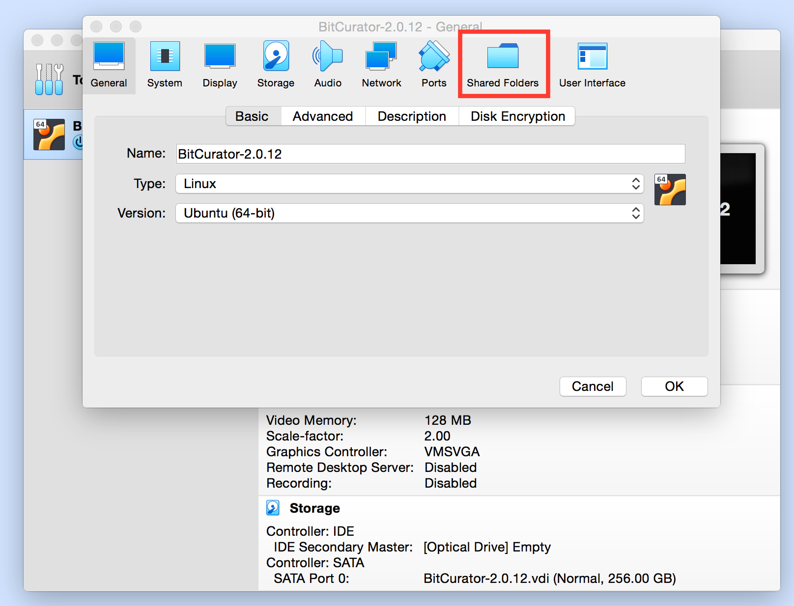
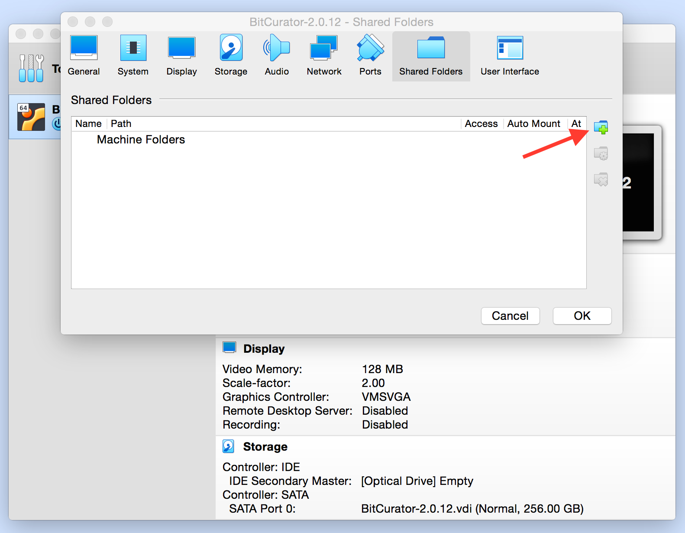
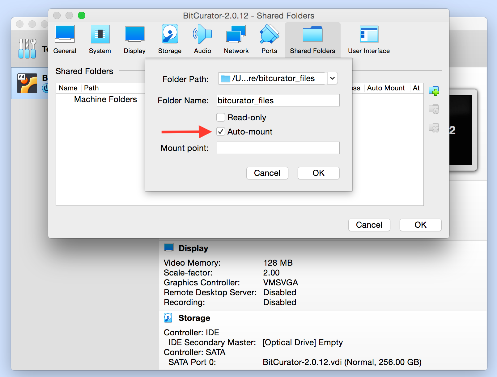
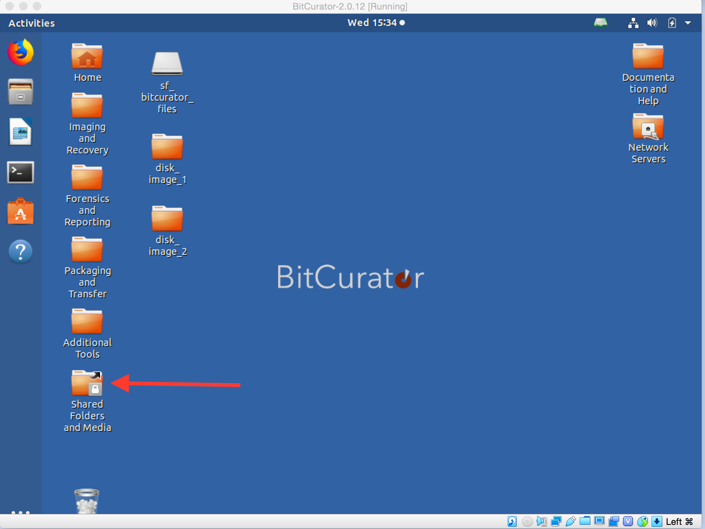
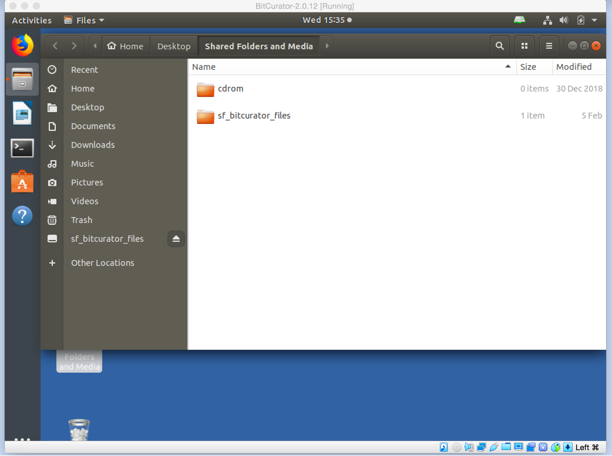
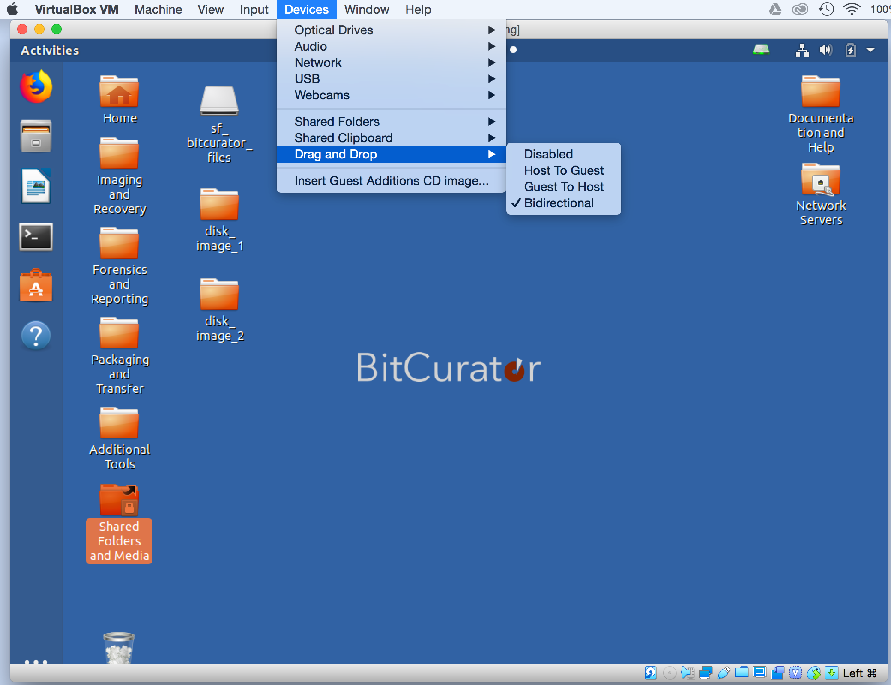
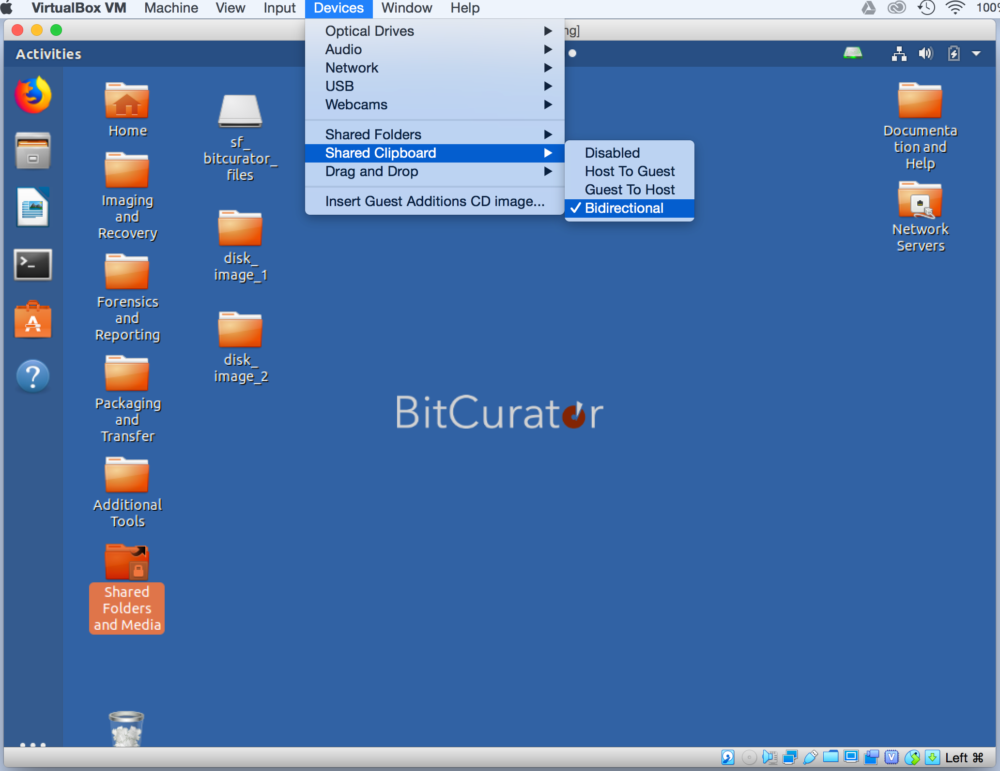

Share files to and from the BitCurator Environment
==================================================

Overview
--------

When using the BitCurator virtual machine, you may wish to transfer a file, multiple files, or folder between the BitCurator environment and your machine (e.g. from the BitCurator VM desktop to the desktop of the machine on which you're running BitCurator); the following instructions will help you do this.

**If you're interested in creating a disk image of a piece of born-digital media, it's highly recommended you follow [these instructions](https://confluence.educopia.org/display/BC/Imaging+with+Guymager)** to create the disk image within the BitCurator environment, which will package information about the imaging process with the disk image so that in the future, it's easy to call up information about that image such as who imaged it and when the imaging took place.

Setup folder sharing between BitCurator and your machine
--------------------------------------------------------

1. Before you start up the BitCurator virtual machine, select Settings in the VirtualBox window, and select Shared Folders (see Figure 1). 
	* *Note:* A prompt may open asking if you would like to install the VirtualBox Guest Additions. Although BitCurator comes with the Guest Additions preinstalled, you may need to install an updated Guest Additions package if you are running a recent release of VirtualBox.  
**Figure 1**: Select "Shared Folders" from the Devices menu.  

2. Click on the folder icon with the green plus in it, and select “Other...” under “Folder Path...” (see Figure 2).  

      

1. Click “Make New Folder” to make a new shared folder somewhere on your host machine (e.g. in the home directory of your host computer). 

Use the VirtualBox tool to create the new folder in order to make sure that your guest OS will have permission to access it.
2. Select “Auto Mount” and leave "Read Only" unchecked, and click OK. 

3. Click OK again, in the main window.
4. The BitCurator desktop includes a folder named "Shared Folders and Media" that points to the /media directory (see Figure 5). Once you've added a host shared folder using the instructions above, that host shared folder will automatically appear in this desktop "Shared Folders and Media" folder location with an "sf\_" prefix. If you can open this shared directory, then you can save files here that will be available both in the host environment and the BitCurator virtual machine. Likewise, you can place files in this directory when you are in the host environment and they will be available for the BitCurator virtual machine as well.

  

  

Drag and Drop folders between BitCurator and your machine
---------------------------------------------------------

Depending on your Virtual Machine set-up, you may already be able to drag and drop files from your machine into and out of the BitCurator virtual machine ("drag and drop" means to click on a file and then continue holding the mouse button down while moving your ouse cursor where you wish the file to go, which gives the appearance of physically "dragging" the file to a new location). If this is not the case, start up the BitCurator virtual machine and follow these steps:

1. In the menu bar along the top of your machine's screen (outside the virtual machine window), click on "Devices" > "Drag'n'Drop" > "Bidirectional". "Bidirectional" should now have a checkmark appear next to it in the menu.  
  

2. You should now be able to drag and drop files between BitCurator and your host machine (e.g. you can drag an already created disk image into the BitCurator environment for exploration, though note that it's highly recommended you follow [these instructions](http://wiki.bitcurator.net/index.php?title=Creating_a_Disk_Image_Using_Guymager "Creating a Disk Image Using Guymager")**to create the disk image within the BitCurator environment in the first place rather than creating it elsewhere, as this will package information about the imaging process with the disk image so that in the future, it's easy to call up information about that image such as who imaged it and when the imaging took place).**

Due to a VirtualBox limitation, "dragging and dropping" files from the host to the BitCurator virtual machine will no longer work when only one processing core is assigned. If you wish to use this feature, please assign at least two processing cores to the virtual machine (via "Settings" in the VirtualBox manager).

  

Share your Clipboard
--------------------
1. In the menu bar along the top of your machine's screen (outside the virtual machine window), click on "Devices" > "Shared Clipboard" > "Bidirectional". "Bidirectional" should now have a checkmark appear next to it in the menu.  
  

2. Items copied to your clipboard in either the BitCurator or host machine environment should now be available in the other environment (e.g. text copied from a website in a browser on your host machine will be available to paste from the clipboard into a text document in the BitCurator environment).

  

VirtualBox incompatibilities
----------------------------

**USB 3.0 ports** are not currently supported by VirtualBox for use with USB flash and hard drives. If you get the error "USB device [name and UUID of device] is busy with a previous request. Please try again later.", try using either a 2.0 or 1.1 USB port (many desktops include both 2.0 and 3.0 ports, but newer laptops may only have 3.0 USB ports).

**Firewire input** is also not supported by VirtualBox. For media devices that require firewire (e.g. to image a Mac laptop in target disk mode), you will need to use BitCurator on an existing Linux machine or installed from the ISO as a stand-alone operating system.

 If you would like to provide feedback for this page, please follow this [link to the BitCurator Wiki Google Form](https://docs.google.com/forms/d/e/1FAIpQLSelmRx1VmgDEg3dU5_8cXZy9MZ5v8_sAl-Ur2nPFLAi6Lvu2w/viewform?usp=sf_link) for the BitCurator All Step-by-Step Guides section.

