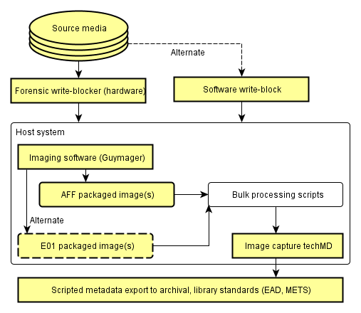
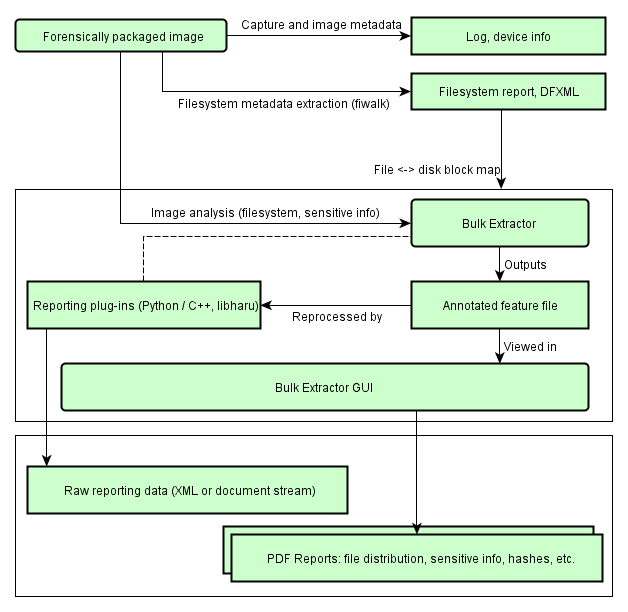
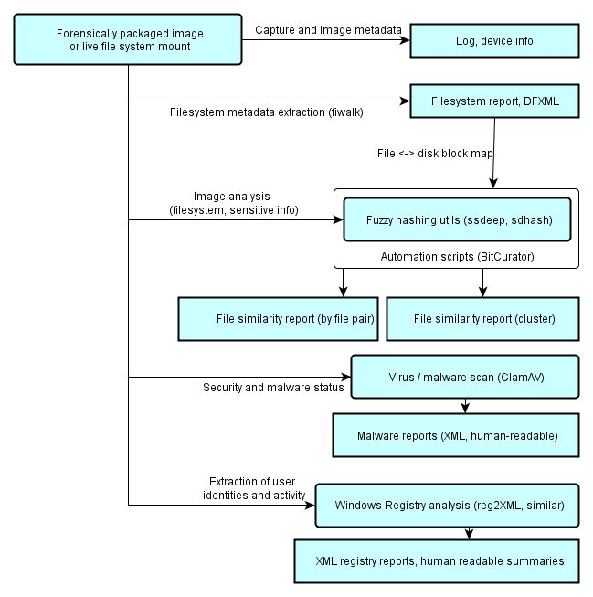
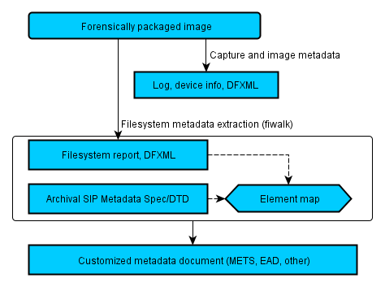

Original Project Diagrams
=========================

The following original diagrams for the BitCurator Environment's functionality give insight into the high-level design and thought process for acquisition, processing, analysis and description, along with the technical implementation of tools and specifications.

### Forensic Disk Imaging

  

### Forensic Processing and Identification of Potentially Sensitive Information

### Data Triage

### Metadata Export

  

  

  

 If you would like to provide feedback for this page, please follow this [link to the BitCurator Wiki Google Form](https://docs.google.com/forms/d/e/1FAIpQLSf-CPGSFB4809-SZU-ZtqYPFNvSZ2xBbBOfgcRdCdx9bast9A/viewform?usp=sf_link) for the About section.

