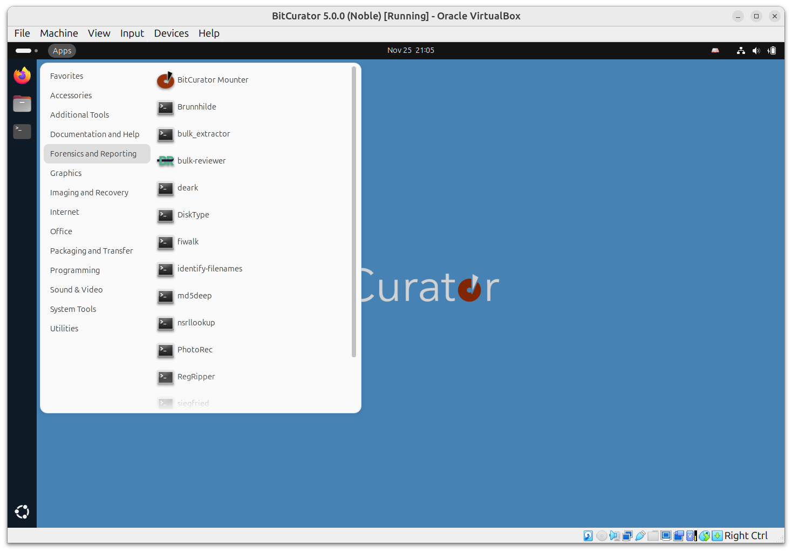

Forensics and Reporting Guides
==============================

### Overview

Guides for file format identification, location of deleted files and files fragments, cryptographic hashing, and reporting on potentially private and personally identifying information.

### Submenu

The Forensics and Reporting submenu lists forensics and forensics-adjacent tools. These include:

* **BitCurator Mounter**: A lightweight GUI tool to assist with mounting and unmounting devices.
* **Brunnhilde**: A tool to generate aggregate reports of files in a directory or disk image based on input from Richard Lehane's [Siegfried](http://www.itforarchivists.com/siegfried). Can optionally analyze content using bulk_extractor.
* **bulk_extractor**: A tool to scan disk images and directories for PII and other features.
* **Bulk Reviewer**: A tool to scan disk images and assist in the review of bulk_extractor reports.
* **Deark**: A utility for file format and metadata analysis, data extraction, decompression, and image format decoding.
* **DiskType**: A tool to detect the content format of a disk or disk image. It knows about common file systems, partition tables, and boot codes.
* **fiwalk**: A program that processes a disk image using the SleuthKit library and outputs its results in Digital Forensics XML, the Attribute Relationship File Format (ARFF) format used by the Weka Datamining Toolkit, or an easy-to-read textual format.
* **identify-filenames**: A postprocessing script for bulk_extractor that reads report files and produces annotated versions with the file that contains each feature (when present) identified.
* **md5deep**: a set of programs to compute [MD5](https://md5deep.sourceforge.net/#md5), [SHA-1](https://md5deep.sourceforge.net/#sha1), [SHA-256](https://md5deep.sourceforge.net/#sha256) and other digests
* **nsrllookup**: Query NSRL’s MD5 hashes of known pieces of software.
* **PhotoRec**: File data recovery software designed to recover lost files including video, documents and archives from media.
* **RegRipper**: Extract the contents of Windows registry backups.
* **Siegfried**: Signature-based file format identification.
* **SSDeep**: Fuzzy hashing tool.
* **TestDisk**: Data recovery software, companion to PhotoRec.

### Guides

* [Analyzing a Disk Image with Brunnhilde](Analyzing a Disk Image with Brunnhilde)  
* [Fiwalk](Fiwalk)
* [pyExifToolGUI](pyExifToolGUI)
* [HFS Explorer](HFS Explorer)
* [Bulk Extractor Viewer](Bulk Extractor Viewer)
* [Regular Expressions in Bulk Extractor](Regular Expressions in Bulk Extractor)
* [Understanding Bulk Extractor Scanners](Understanding Bulk Extractor Scanners)
* [Scanning Disk Images and Directories with Bulk Reviewer](Scanning Disk Images and Directories with Bulk Reviewer)
* [Disk Image Reports](Creating Disk Image Reports using the BitCurator Reporting Tool)
* [Annotated Features Report](Annotated Features Report)
* [Forensic Reports](Forensic Reports)
* [FSlint](FSlint)
* [Access and Export Files from Disk Images](Access and Export Files from Disk Images)
* [Data Triage (Nautilus)](Data Triage (Nautilus)
* [Create MD5 Sums (Nautilus)](Create MD5 Sums (Nautilus))
* [Display a file in Hex editor (Nautilus)](Display a file in Hex editor (Nautilus))
* [Disk Image Metadata (Nautilus)](Disk Image Metadata (Nautilus))
* [Extract Compressed Files (Nautilus)](Extract Compressed Files (Nautilus))
* [Live Search for Files (Nautilus)](Live Search for Files (Nautilus))

  

