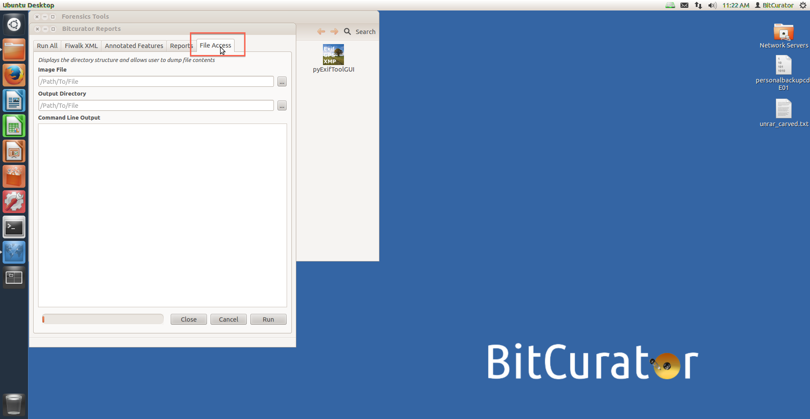
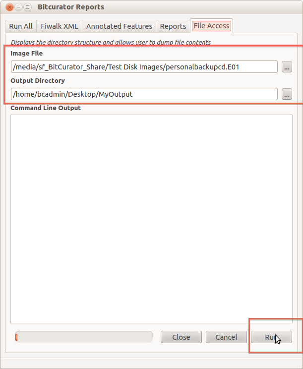
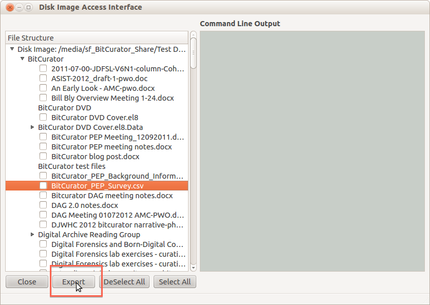

Access and Export Files from Disk Images
========================================

### Overview

The "File Access" tab in the BitCurator Reporting tool allows you to access files on a disk image (including partial, hidden, and deleted files). For example, you can use this tool to open and read a Word Document on a disk image.

### Step-by-Step Guide

1. Open the BitCurator Reporting Tool by double clicking on the "Forensics Tools" folder on the BitCurator desktop and then double clicking on the "BitCurator Reporting Tool" icon.
2. Once the BitCurator Reporting Tool finishes opening, select the "File Access" tab from the options along the top (see Figure 1).  
  
**Figure 1**: Selecting the File Access tab.  

3. In the "Image File" field, fill in or navigate to (using the "..." button to the right of the field) the disk image file you wish to access. In the "Output Directory" field, fill in or navigate to create a new folder in which to place the output. Click the "Run" button in the bottom-right of the window when you're done (see Figure 2).  
  
**Figure 2**: Filling out the fields and clicking "Run".  

4. You'll see a success message in the "Command Line Output" window once the utility has completed, and a new window will open allowing you to access the files on your disk image (including partial, hidden, and deleted files). Select any number of files you wish to view or work with and click the "Export" button to place them somewhere where you can work with them like normal files (see Figure 3).  
  
**Figure 3**: Access the files on the disk image.  

