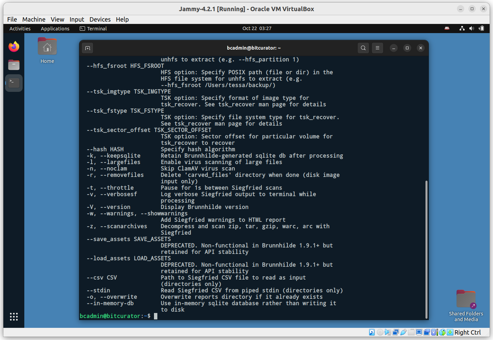
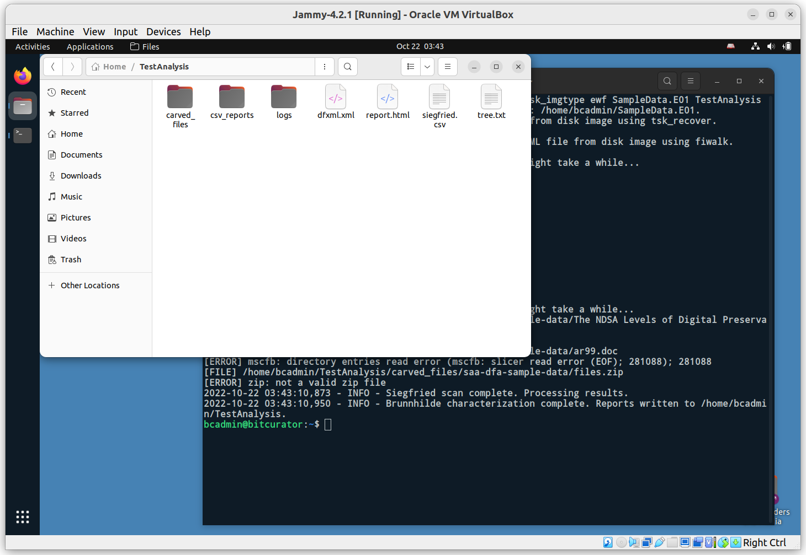

# Overview

BitCurator includes a variety of tools to analyze and report on disk images and the filesystems they contain. For this Quickstart guide, we will focus on the command line tool [Brunnhilde](https://github.com/tw4l/brunnhilde), a Siegfried-based characterization tool for directories and disk images.

In the Applications menu in the top left, navigate to the Forensics and Reporting submenu, and select Brunnhilde. A new terminal window will appear, in which the following command has been run to show Brunnhilde’s help documentation:

`brunnhilde.py -h`

Your terminal window may be too small to see all of the flags and options in the help output. Make the window larger, or scroll up if you’d like to see the full list of options.

For this example, we’ll be instructing Brunnhilde to analyze an EWF disk image containing a FAT filesystem, carve out all of the files it can find, create a set of common reports, and run a Clam virus scan. The command we will issue is as follows:

`brunnhilde.py -d --tsk_fstype fat --tsk_imgtype ewf SampleData.E01 TestAnalysis`

Using this command, Brunnhilde will create a new TestAnalysis directory under `/home/bcadmin`, where we will find the output.

Brunnhilde will carve files out of the image using `tsk_recover`, generate a DFXML report for the filesystem using `fiwalk`, execute the virus scan, and run an analysis with Siegfried.

You can examine the output by navigating to the new `TestAnalysis` folder:

Brunnhilde provides many other options, including scanning files with bulk_extractor. To enable bulk_extractor, simply add the `-b` flag to the previous command:

`brunnhilde.py -d -b --tsk_fstype fat --tsk_imgtype ewf SampleData.E01 TestWithBE`

You should see a new directory, `TestWithBE` under `/home/bcadmin`, that now also contains a bulk_extractor directory with the scanner output files in it.

Consult the [Brunnhilde documentation](https://github.com/tw4l/brunnhilde/blob/main/README.md) for additional detail.
