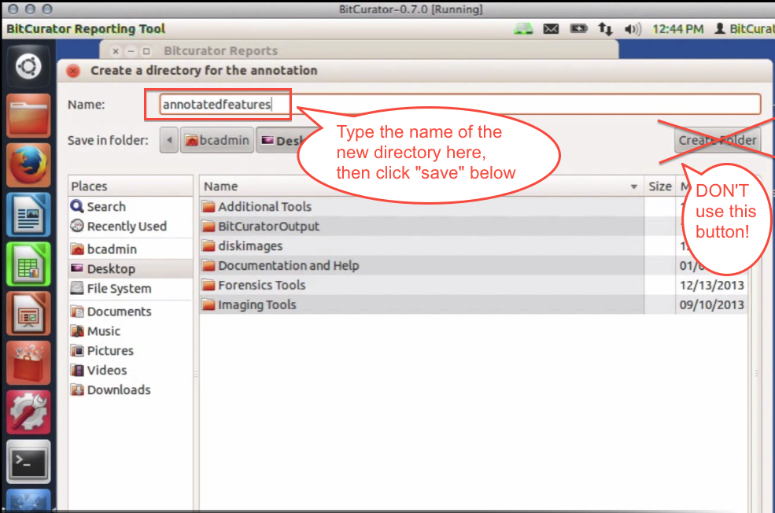
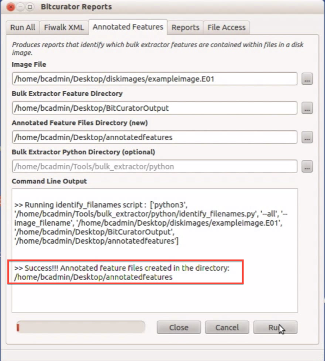

Annotated Features Report
=========================

### Overview

The Annotated Features tab in the BitCurator Reporting Tool matches the "features" found by bulk\_extractor with their corresponding file on the disk image. **This step is necessary because bulk\_extractor locates features by scanning the bit stream, not the file system**. The annotated features report acts as a bridge between the output from bulk\_extractor and the DFXML report from fiwalk to create a report that not only locates a feature, but also identifies the specific file in which it can be found.

Bulk\_extractor uses the term "feature" to describe any items it finds while scanning a disk image. A social security number or email address would be examples of a bulk\_extractor feature. See [this page](/documentation/BitCurator Environment/All Step-by-Step Guides/Forensics and Reporting Guides/Understanding Bulk Extractor Scanners) for more information on what features bulk\_extractor can locate.### Step-by-Step Guide

1. Open the BitCurator Reporting Tool by double clicking on the "Forensics Tools" folder on the BitCurator desktop and then double clicking on the "BitCurator Reporting Tool" icon.
2. Once the BitCurator Reporting Tool finishes opening, select the "Annotated Features" tab from the options along the top (see Figure 1).
3. Type or navigate to the location of the following files or directories (see Figure 1):

	* Image File: The location of the forensics disk image being analyzed.
	* Bulk Extractor Feature Directory: The directory containing the bulk\_extractor results from the disk image above.
	* Annotated Feature Files Directory (new): A new directory the BitCurator Reporting Tool will create to contain the annotated features report you are currently generating. **Note:** if you use the navigation button to select this directory, type the name of the new directory in the "Name:" field on the top left of the window. *Do not* use the "Create Folder" button on the right to create this new directory (see Figure 2).
	* Bulk Extractor Python Directory (optional): location of any additional python scripts--generally left blank  
	  
	**Figure 1**: The Annotate Features tab in the BitCurator Reporting Tool.  
	  
	  
	**Figure 2**: Type the name of the new directory in the "Name" field.  
	
4. Once each of the file and directory fields above are properly filled out, click the "Run" button. The activity bar on the bottom left will indicated the annotation process is still ongoing. Once complete, a success or error message will appear in the "Command Line Output" window (see Figure 3).  
  
**Figure 3**: The annotated features report has been successfully created.  

  

 If you would like to provide feedback for this page, please follow this [link to the BitCurator Wiki Google Form](https://docs.google.com/forms/d/e/1FAIpQLSelmRx1VmgDEg3dU5_8cXZy9MZ5v8_sAl-Ur2nPFLAi6Lvu2w/viewform?usp=sf_link) for the BitCurator All Step-by-Step Guides section.

