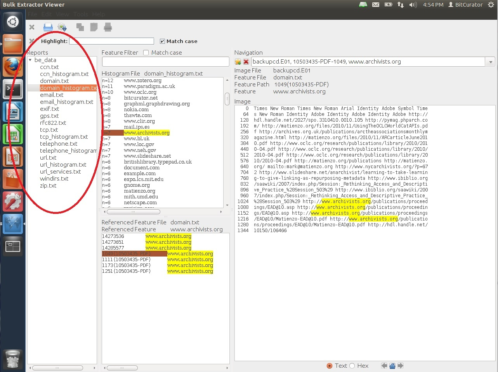

Bulk Extractor Viewer
=====================

*Note: The 2.x releases of bulk_extractor do not include the BEViewer GUI front end.*

### Overview

The Bulk Extractor Viewer (BEviewer) is a graphical interface for [bulk\_extractor](https://forensics.wiki/bulk_extractor/), "a C++ program that scans a disk image, a file, or a directory of files and extracts useful information without parsing the file system or file system structures. The results can be easily inspected, parsed, or processed with automated tools. bulk\_extractor also creates a histogram of features that it finds, as features that are more common tend to be more important."

While originally intended for law enforcement, bulk\_extractor can be used by digital archivists to quickly and thoroughly examine a disk image for a wide variety of information. The most common use for such analysis is locating personally identifiable information (PII) that a donor may want redacted before his or her materials are made publicly available, but bulk\_extractor can locate other types of potentially sensitive information as well.

The instructions below take you through the process of running bulk\_extractor via the Bulk Extractor Viewer utility, a GUI interface for running bulk\_extractor and viewing the results. Archivists can view the results through the GUI and also further process them using the digital forensics tools in the BitCurator environment.

### Step-by-step Guide

### Using bulk\_extractor to Find Potentially Sensitive Information on a Disk Image

1. The first step is to create a working directory to hold the bulk\_extractor data. To do this, open Nautilus by double clicking on the "Home" folder on your desktop. Then right click anywhere on the white background (i.e., not on an existing folder), and click "Create New Folder" from the pull-down menu. You can name the directory as you see fit, but for this example we'll name the directory "test\_data".
2. Next open the Bulk Extractor Viewer utility by double clicking on the "Forensics Tools" folder on your desktop, and then double clicking on "Bulk Extractor Viewer".
3. After Bulk Extractor Viewer opens, click on the gear icon with the down arrow to begin generating a report using bulk\_extractor (see Figure 1).  
  
**Figure 1**: Click the gear icon to begin the bulk\_extractor process.  

4. Clicking on the Generate a Report icon will open the "Run bulk\_extractor" window. From this window you can specify the image you would like to analyze, the location of the output directory, and further refine the types of data objects bulk\_extractor will search for.To begin your analysis, first select the type of media you want to scan, which in our case is a disk image, so we'll select the "image file" radial button (see Figure 2)
5. Next, type or navigate to the location of the disk image in the "Image file" field (see Figure 2).  
  
**Figure 2**: The "Run bulk\_extractor" window.  

6. Enter the name of the directory you wish to create for holding the Bulk Extractor output; Bulk Extractor Viewer will create this directory for you. For example, if you wanted to save the bulk\_extractor output to a directory named "be\_reports" in your working directory, you would enter "/home/bcadmin/[name of working directory]/be\_reports" in the Output Feature Directory field. If the directory be\_reports doesn't already exist, BE Viewer will create it for you.
7. Optional: If desired, you may check or uncheck the [scanner options](/documentation/BitCurator Environment/All Step-by-Step Guides/Forensics and Reporting Guides/Understanding Bulk Extractor Scanners) from the list on the right (see Figure 3). You can refine your analysis of the disk image by choosing which "scanners" bulk\_extractor employs. "Scanners" in bulk\_extractor are modular sets of rules that allow bulk\_extractor to find specific types of information on a disk image. For example, if you have the "accts" scanner selected, bulk\_extractor will find objects (which it calls "features") such as credit card numbers, social security numbers, phone numbers, etc. A chart defining the various scanners, how they may be useful to you, and where they output their results can be found [here](/documentation/BitCurator Environment/All Step-by-Step Guides/Forensics and Reporting Guides/Understanding Bulk Extractor Scanners).  
  
**Figure 3**: Scanner options in the Bulk Extractor Viewer.  

*Note:* Because bulk\_extractor generates a large number of files, it requires a new directory for the output. **Bulk\_extractor will create the new directory.** If you navigate to the output directory instead of type it in, a window will open asking you for the path to the new directory along with its name. In our example, the output directory would be "/home/bcadmin/test\_data/" and the new directory to be created by bulk\_extractor would be called "be\_data" (see Figure 4).

**Figure 4**: The "Name the output folder for bulk\_extractor.  

8. Finally, click the "Start bulk\_extractor" button at the bottom of the screen to begin the scan.
9. Once bulk\_extractor has finished analyzing the disk image, you can view the output by selecting the new report in the "Reports" window of Bulk Extractor Viewer. The report will be named after the Features Output Directory you created in step 6, so in our example we will see "be\_report" (see Figure 5). Once you select the report, you will see a listing of each scanner for which a feature was found by bulk\_extractor. Selecting a specific scanner or its histogram will cause the features to be listed in the window to the right. Selecting a specific feature will show the file in which it is located to be displayed in the "Image" window.  
  
**Figure 5**: View the bulk\_extractor report.  

