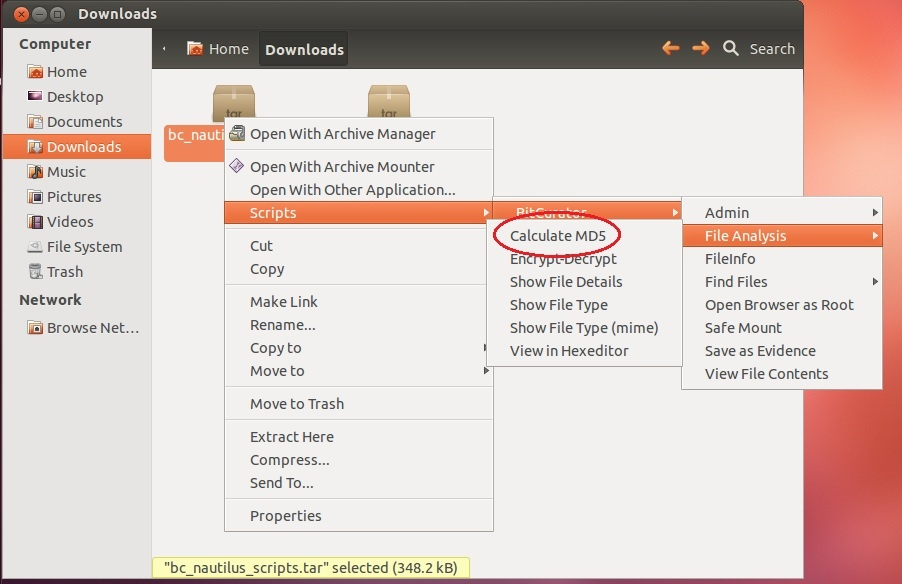
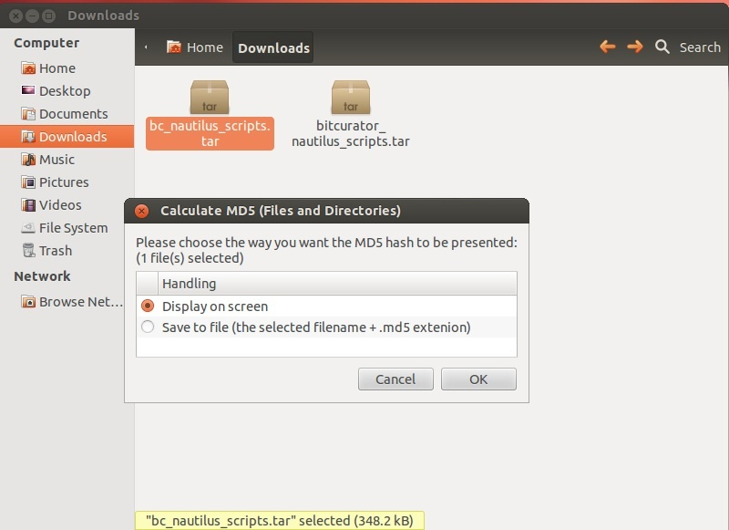

Create MD5 Sums (Nautilus)
==========================

### Overview

A checksum (of which MD5 sums are one type) is a string of characters produced by an algorithm acting on a file.

The checksum is used to validate data integrity, as the algorithm will produce a different checksum if any changes occur to the file in question, making it easy to detect errors that may have been introduced during the file's transmission or storage (e.g. due to physical damage, bit rot, malicious intent, or accidental non-write-protected usage). The sum thus acts as an identifier for the file in its exact current state. You can calculate the sum at a point when you know your file (e.g. a disk image) isn't corrupted or altered from how you think it should be, and calculate the sum again at later points in time, comparing the newly calculated sum to the original sum to check that the disk has not been corrupted or altered. See this [page](https://en.wikipedia.org/wiki/Checksum) for more on how checksums work.

### Step-by-Step Guide

1. Open Nautilus and navigate to the file or files for which you would like to calculate MD5 sums.
2. Select the desired file or files.
3. Right click on any of the file icons and select Scripts > File Analysis > Calculate MD5 (see Figure 2).  
  
**Figure 2**: Select "Calculate MD5" from the Nautilus script menu.  

4. Select whether you would like the MD5 sum to be displayed or saved (if you have selected multiple files, the output will be saved by default) (see Figure 3).  
  
**Figure 3**: Choose to either save or display the MD5 sum output.

5. If you chose to save the MD5 sum(s), a file listing each of the MD5's will be generated in your present directory. Otherwise the MD5 sum will be displayed in a window.

