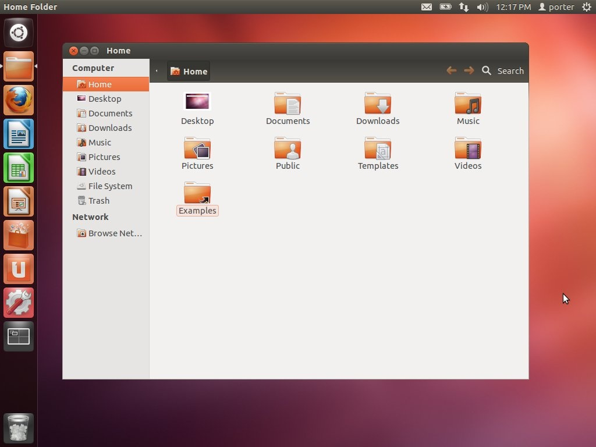

Data Triage (Nautilus)
======================

Nautilus (see Figure 1) is a popular GUI file manager for Linux and is the default file manager in Ubuntu Linux 12.04. It functions similarly to *Windows Explorer* on Windows systems and *Finder* on Macs. One key feature of Nautilus is the ability to add custom functionality by incorporating user-created [back-end scripts](https://help.ubuntu.com/community/NautilusScriptsHowto). These scripts work much like plug-ins for a web browser and extend Nautilus's basic functionality. We have included a number of custom Nautilus scripts in the BitCurator Environment specifically geared to assist the digital archivist in pre-ingest data analysis. See below for specific instruction on how to use Nautilus to perform a number of critical data analysis tasks.

  

**Figure 1**: Nautilus file manager in Ubuntu Linux 12.04

  

Common disk image, file, and metadata handling tasks:
-----------------------------------------------------

* ### [Create MD5 Sums (Nautilus)](/documentation/BitCurator Environment/All Step-by-Step Guides/Forensics and Reporting Guides/Create MD5 Sums (Nautilus))
* ### [Display a file in Hex editor (Nautilus)](/documentation/BitCurator Environment/All Step-by-Step Guides/Forensics and Reporting Guides/Display a file in Hex editor (Nautilus))
* ### [Disk Image Metadata (Nautilus)](/documentation/BitCurator Environment/All Step-by-Step Guides/Forensics and Reporting Guides/Disk Image Metadata (Nautilus))
* ### [Extract Compressed Files (Nautilus)](/documentation/BitCurator Environment/All Step-by-Step Guides/Forensics and Reporting Guides/Extract Compressed Files (Nautilus))
* ### [Live Search for Files (Nautilus)](/documentation/BitCurator Environment/All Step-by-Step Guides/Forensics and Reporting Guides/Live Search for Files (Nautilus))
* ### [Review File Info and Details (Nautilus)](/documentation/BitCurator Environment/All Step-by-Step Guides/Forensics and Reporting Guides/Review File Info and Details (Nautilus))

