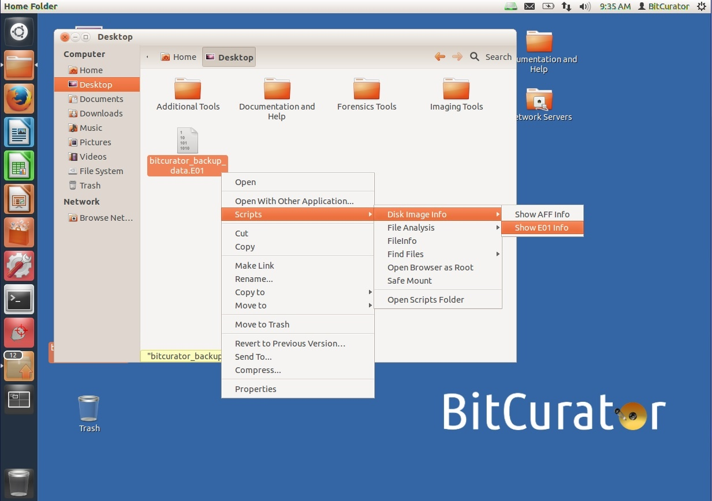
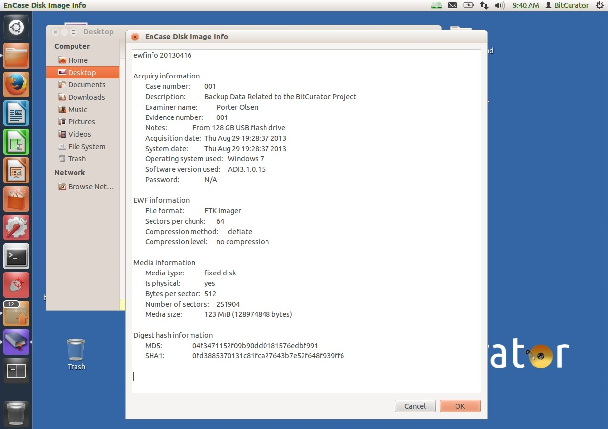

Disk Image Metadata (Nautilus)
==============================

### Overview

One of the primary benefits to using forensics disk images--as opposed to a raw disk image--is that the metadata created during the imaging process is packaged with the disk image itself. That way, no matter where the disk image is moved, its metadata always travels with it. This Nautilus script allows users to quickly and easily view the forensics metadata associated with either an EnCase (E01) or Advanced Forensics Format (AFF) disk image.

### Step-by-Step Guide

1. Open Nautilus and navigate to the directory containing either an AFF or E01 disk image.
2. Right click on the disk image and select Scripts > Disk Image Info > Show E01 Info (or Show AFF Info if viewing an AFF disk image; see Figure 12).  
  
**Figure 12**: Select either EO1 or AFF depending on the disk image type  

3. A new window will open displaying the forensics metadata captured during the disk imaging process. The metadata displayed includes the case or accession number, a description of the original media, the name of the processor, original media size, date the disk image was create, any hashes created during the imaging process, and more (see Figure 13).  
  
**Figure 13**: Metadata about the original media, disk image, and imaging process.  

  

