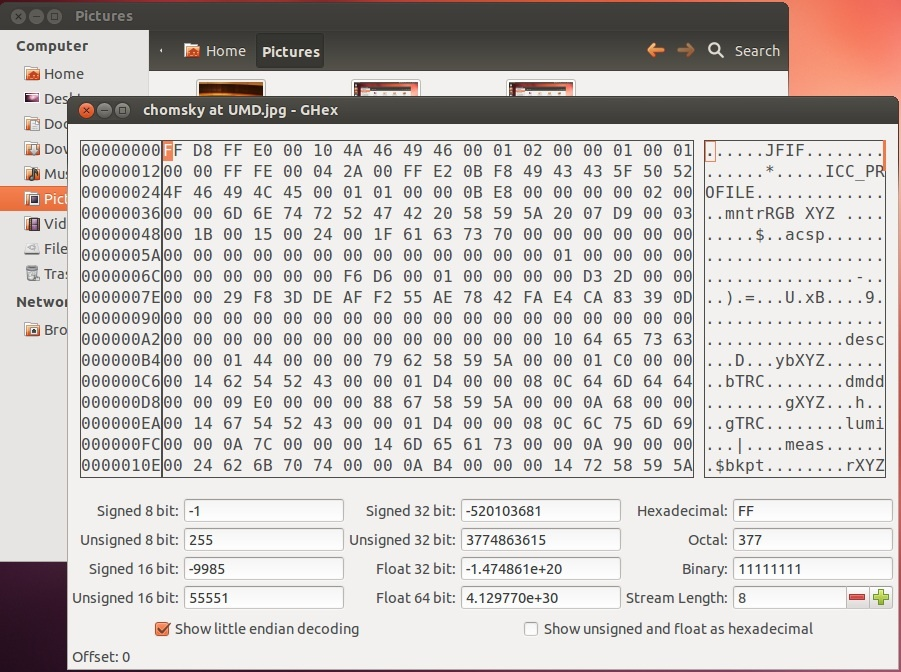

Display a file in Hex editor (Nautilus)
=======================================

1. Open Nautilus and navigate to the desired file.
2. Right click the file and select Scripts > File Analysis > View in Hexeditor (see Figure 6).

**Figure 6**: Viewing a file in hex.

 If you would like to provide feedback for this page, please follow this [link to the BitCurator Wiki Google Form](https://docs.google.com/forms/d/e/1FAIpQLSelmRx1VmgDEg3dU5_8cXZy9MZ5v8_sAl-Ur2nPFLAi6Lvu2w/viewform?usp=sf_link) for the BitCurator All Step-by-Step Guides section.

