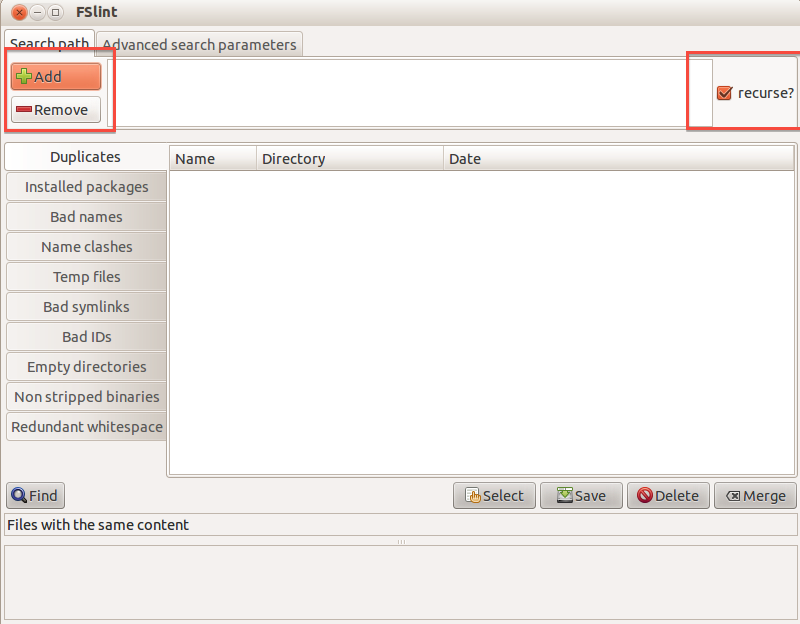
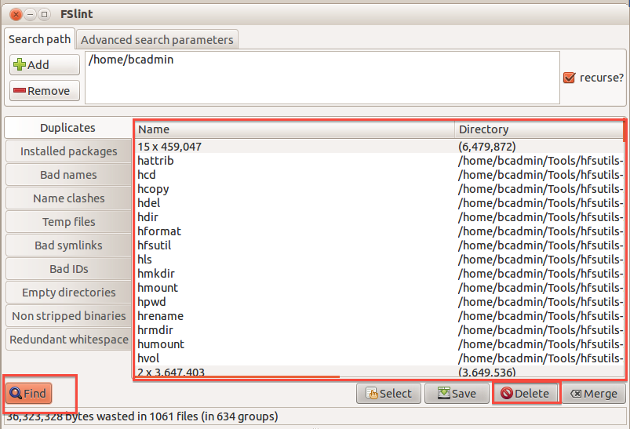

FSlint
======

As of February 5, 2020, FSlint is no longer included in the BitCurator Environment (version 2.2.0 and beyond). It can still be installed in the environment - see the [project website](http://www.pixelbeat.org/fslint/) for more details.

### Overview

The BitCurator environment incorporates [FSlint](http://www.pixelbeat.org/fslint/) to help you to rapidly scan file directory contents to identify duplicate files, and delete selected items from those duplicates.

### Step-by-Step Guide

1. Double-click on the "Forensics Tools" folder on the BitCurator desktop, then double-click on the "FSlint" icon.
2. Click the button with the green plus sign that says "Add", at the left of the window, and navigate to the directory you wish to scan for duplicates. You can use the "Add" button to add more directories to scan, or use the "Remove" button immediately below it to remove a selected directory path from the list of directories to scan. "Check the "recurse?" checkbox at the right side of the window if you wish to scan not just that directory's direct contents, but also the files inside any folders it contains (see Figure 1).  
  
**Figure 1**: Choose the directories to scan for duplicates.  

3. Click on the "Find" button with the magnifying glass icon in the lower-left of the window. A list of any located duplicate files will populate the window. Select any of these files that you wish to delete; select multiple files at once using the control key. Click on the "Delete" button at the bottom-right of the window (see Figure 2).  
  
**Figure 2**: Viewing and deleting the duplicates.  

