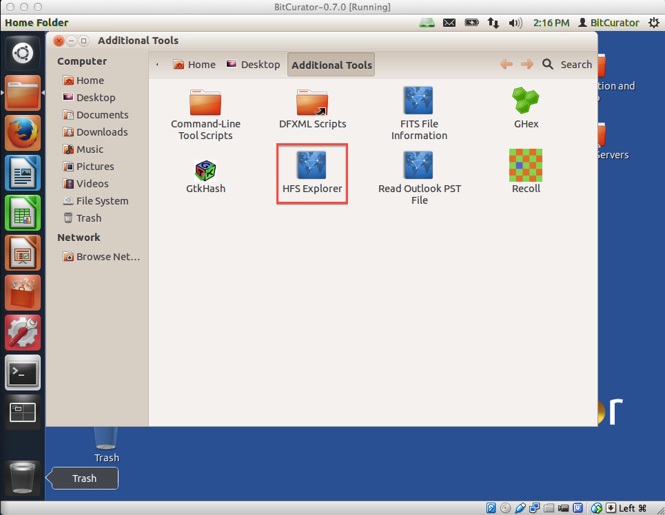
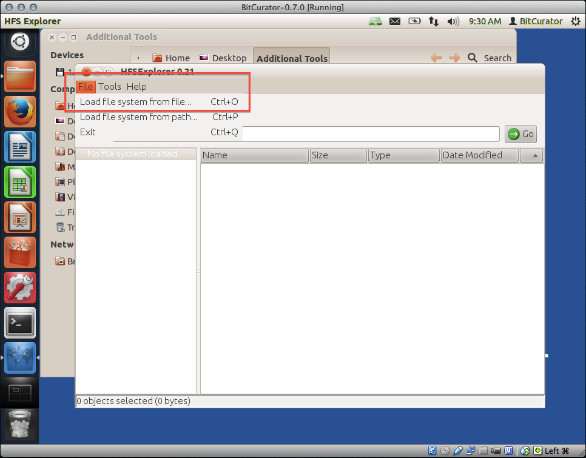
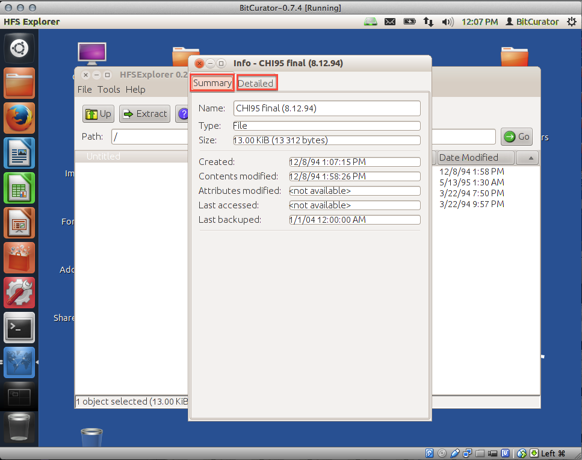
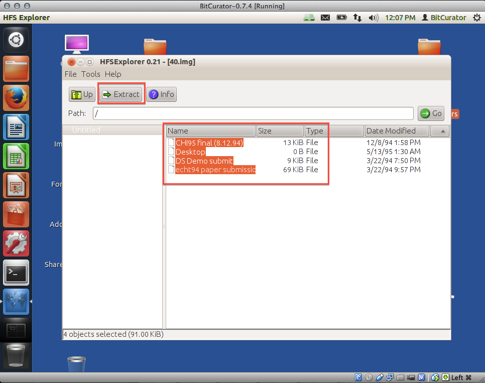
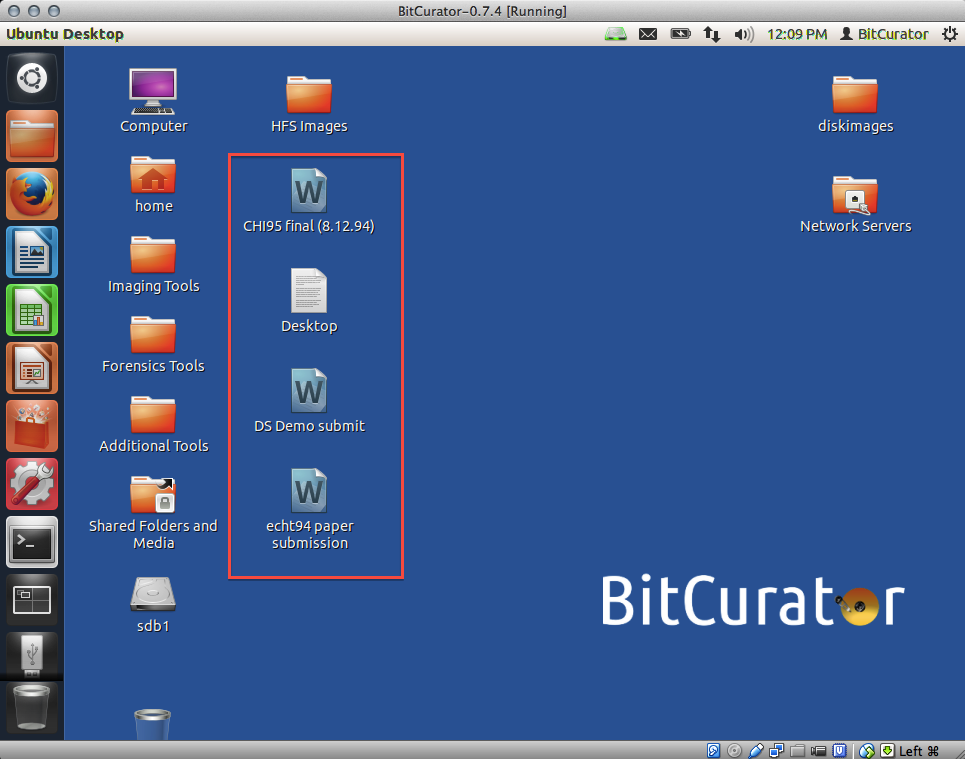

HFS Explorer
============

### Overview

This utility allows you to view the contents of and detailed information on HFS-formatted disk image files, as well as extract files from those images to the BitCurator environment. HFS is a proprietary file system developed by Apple Inc. for use in computer systems running Mac OS. The HFS Explorer is included in the BitCurator environment because many of BitCurator's features (such as Sleuth Kit tools like [fiwalk](https://forensicswiki.xyz/wiki/index.php?title=Fiwalk), which is used to generate DFXML output) cannot currently read HFS-formatted disks.  
To use HFS Explorer, first [image the disk using Guymager](/documentation/BitCurator Environment/All Step-by-Step Guides/Imaging and Recovery Guides/Imaging with Guymager).

### Step-by-Step Guide

1. Open the tool by double clicking on the "Additional Tools" folder on the BitCurator desktop and then double clicking on the "HFS Explorer" icon (see Figure 1).

**Figure 1**: Opening HFS Explorer.

2. The HFS Explorer window will open. Click on the "File" menu item in the top left corner of the window, and then select "Load file system from file" (see Figure 2).  
  
**Figure 2**: Navigating to the HFS-formatted file.  

3. Choose the file you wish to explore, and click "OK" (see Figure 3).  
  

*Note:* If the file you chose isn't one of the supported file types (HFS, HFS+, HFSX), you'll receive an error message (see Figure 4).

**Figure 4**: This error message occurs if your file is not HFS-formatted.

4. Select a file from the list and click the "Info" button for more information on a file (see Figure 5).  
  
**Figure 5**: Files are viewable.

5. You can now view a summary of basic information about the file, such as when the file was last modified (see Figure 6). To view more detailed information about the file, choose the "Detailed" tab from the top of the window (see Figure 7).

**Figure 6**: View basic information about your file.  

**Figure 7**: View advanced information about your file.

6. To extract files from the HFS-formatted disk to the BitCurator environment, from the main HFS Explorer screen, select the files you wish to extract and then click the "Extract" button from the top left of the window (see Figure 8).

**Figure 8**: Extracting files from the HFS-formatted disk.

7. Navigate to the directory to which you wish to extract the file(s) and click on the "Extract here" button on the lower left (see Figure 9).

**Figure 9**: Navigating to the folder to which to export the file(s).

8. A pop-up will appear asking whether you wish to follow symbolic links when extracting; click the "Yes" button (see Figure 10).

**Figure 10**: Tell HFS Explorer you wish to follow symbolic links.

9. A pop-up will inform you when the extraction is finished (see Figure 11). You can navigate to the extraction directory you specified in Step 7 to view your extracted files (in this example, we extracted a number of files to our desktop; see Figure 12).

**Figure 11**: The extraction is complete.

  

**Figure 12**: Viewing the extracted files on the desktop.

