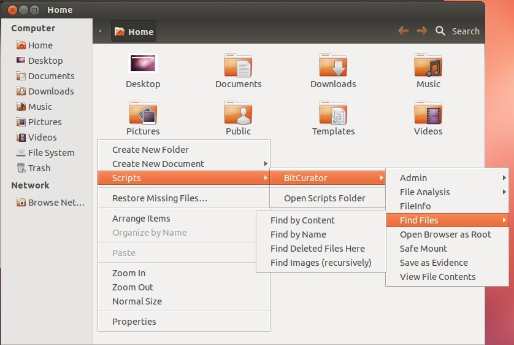
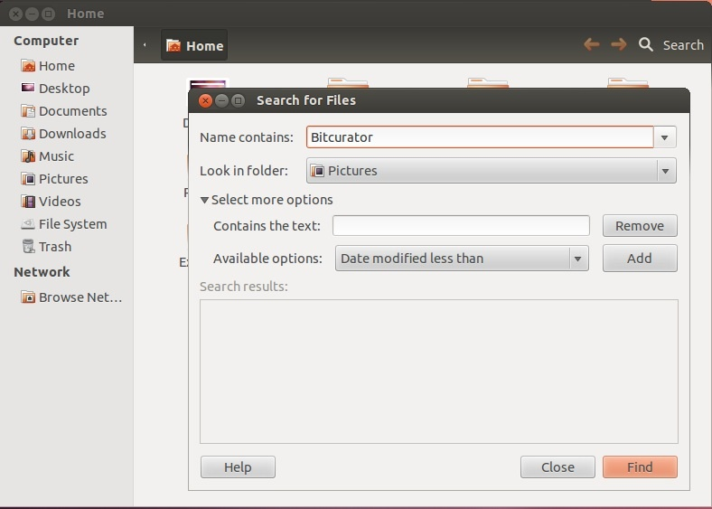
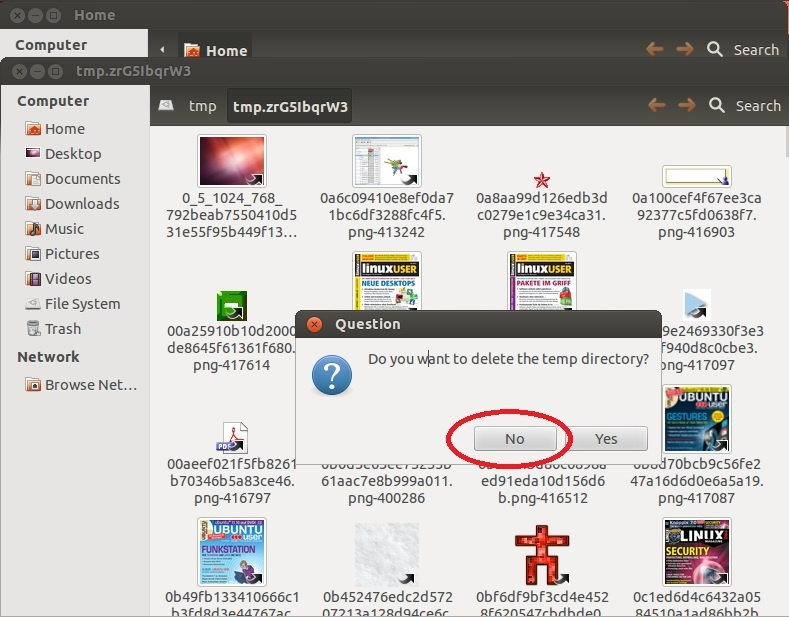

Live Search for Files (Nautilus)
================================

Search for files by either name or content
------------------------------------------

1. Open the Nautilus file browser
2. Right click anywhere within the browser and select Scripts > Find Files (see Figure 7).  
  
**Figure 7**: Choose which of the Find Files options works best for your search.  

3. Select either "Find by Content" or "Find by Name", depending on your search requirements.
4. After the find interface opens, type your search terms into the search window (see Figure 8).  
  
  
**Figure 8**: Enter your search terms in the appropriate window.  

  

 

Search for images recursively from the present directory
--------------------------------------------------------

1. Open the Nautilus file browser.
2. Navigate to the top of the directory tree you would like to search. (Example: to search for all images in a users home directory, navigate to /home/[username])
3. Right click anywhere within Nautilus and select Scripts > Find Files > Find Images (recursively).
4. Nautilus will open a new window and create a temp directory with symlinks to all of the images found in the directory/directories you searched.
5. Click 'No' when asked if you would like to delete the new temp directory (see Figure 9).  
  
**Figure 9**: Click 'No' when asked if you would like to delete the temp directory.  

  

 

 If you would like to provide feedback for this page, please follow this [link to the BitCurator Wiki Google Form](https://docs.google.com/forms/d/e/1FAIpQLSelmRx1VmgDEg3dU5_8cXZy9MZ5v8_sAl-Ur2nPFLAi6Lvu2w/viewform?usp=sf_link) for the BitCurator All Step-by-Step Guides section.

