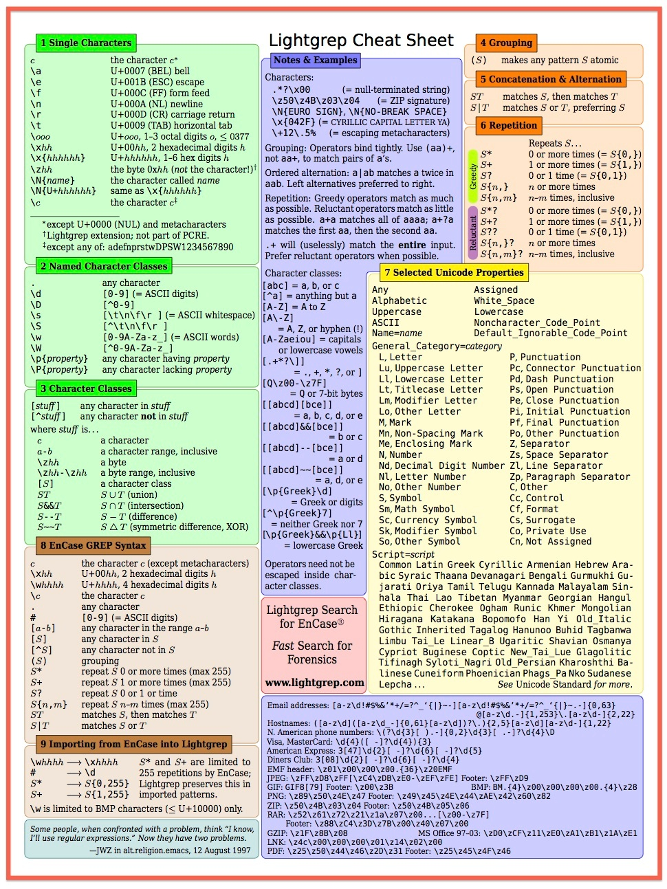

Regular Expressions in Bulk Extractor
=====================================

Matching patterns with regular expressions in bulk\_extractor
-------------------------------------------------------------

The **bulk\_extractor** tool includes the option to find items that match a particular regular expression. (There are many good introductions to working with regular expressions online. If you're not sure where to start, try [Intro to Regex](http://www.joshondesign.com/2011/04/12/joshs-quick-intro-to-regex/) or the [Regular Expression Cheat Sheet](https://docs.exploratory.io/data-wrangling/regular_expression)).

**Figure 1**: Enabling the find (by regex's in file) and find (by a single regex string) in BEViewer.

When using the **bulk\_extractor** GUI, **BEViewer**, there are two options for providing bulk\_extractor regular expressions with which to scan a disk image. Selecting **Use Find Regex Text File** will prompt bulk\_extractor to read in regular expressions (one per line in the file) and generate the appropriate output in the report file **find.txt**. Selecting **Use Find Regex Text** allows the user to enter a single regular expression to be analyzed in the current run (in the text box within the GUI). Selection of both of these options can be seen in **Figure 1**.

Creating new regular expressions within a regex text file
---------------------------------------------------------

If you with to create your own regular expressions, please follow the guidelines in the [**Bulk Extractor Users Manual**](http://digitalcorpora.org/downloads/bulk_extractor/BEUsersManual.pdf). A description of regular expression handling begins on **Page 29**.

Performance considerations
--------------------------

As noted in the **bulk\_extractor** users manual, regular expression searches using the default **find** code can considerably lengthen the time required to process an image. The **bulk\_extractor** tool is capable of using **lightgrep**, which provides better performance when executing such searches as long as the **lightgrep** software is installed.

**Lightgrep** is installed in BitCurator by default in BitCurator 1.6.2 and later. The chart in **Figure 2** provides guidance on searches with **lightgrep**.

**Figure 2**: Lightgrep cheat sheet.

 If you would like to provide feedback for this page, please follow this [link to the BitCurator Wiki Google Form](https://docs.google.com/forms/d/e/1FAIpQLSelmRx1VmgDEg3dU5_8cXZy9MZ5v8_sAl-Ur2nPFLAi6Lvu2w/viewform?usp=sf_link) for the BitCurator All Step-by-Step Guides section.

