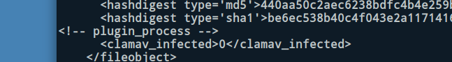

# Running fiwalk with the ClamAV Plugin to Scan Disk Images for Viruses and Malware

The “**Domex Gateway Interface**” (**DGI**) is a plugin specification for `fiwalk` that enables metadata generated by other programs to be embedded in `fiwalk`’s output (for example, a DFXML file) as a key/value pair. BitCurator includes a plugin, `ficlam.sh`, that enables ClamAV to scan files identified within disk images when fiwalk is run. To do this, open a terminal and navigate to the .fiwalk directory with the following command:

`cd ~/.fiwalk`

This directory contains the `ficlam.sh` script, but before we run it we need to provide it with some configuration parameters in a ficonfig-formatted configuration file. This has the following layout:

```
# globpattern    channel    args*
.*              dgi        ./ficlam
```

<!--I cannot figure out how to properly render this code block the way the QuickStart Guide does-->

This specific configuration pattern tells the program to scan all filenames with all extensions (`*.*`). If desired, we could replace this pattern with something more specific - for example, scan only files with the `.exe` file extension (`*.exe`). For now, we’ll create a new configuration file, `clamconfig.txt`, from the command line with this single line:

`echo ‘*.* dgi ./ficlam.sh’ > clamconfig.txt`

Now, run fiwalk with the appropriate flag to tell it to use the plugin:

```
fiwalk -c clamconfig.txt -X /home/bcadmin/SampleDataWithClam.xml /home/bcadmin/SampleData.E01
``` 

A new file, `SampleDataWithClam.xml` will be created in `/home/bcadmin/`. Each identified file result will now include the result of this plugin:


