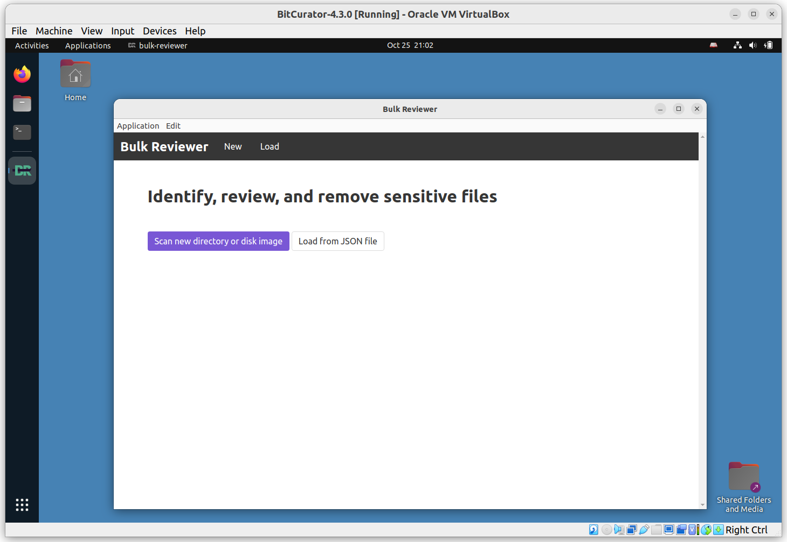
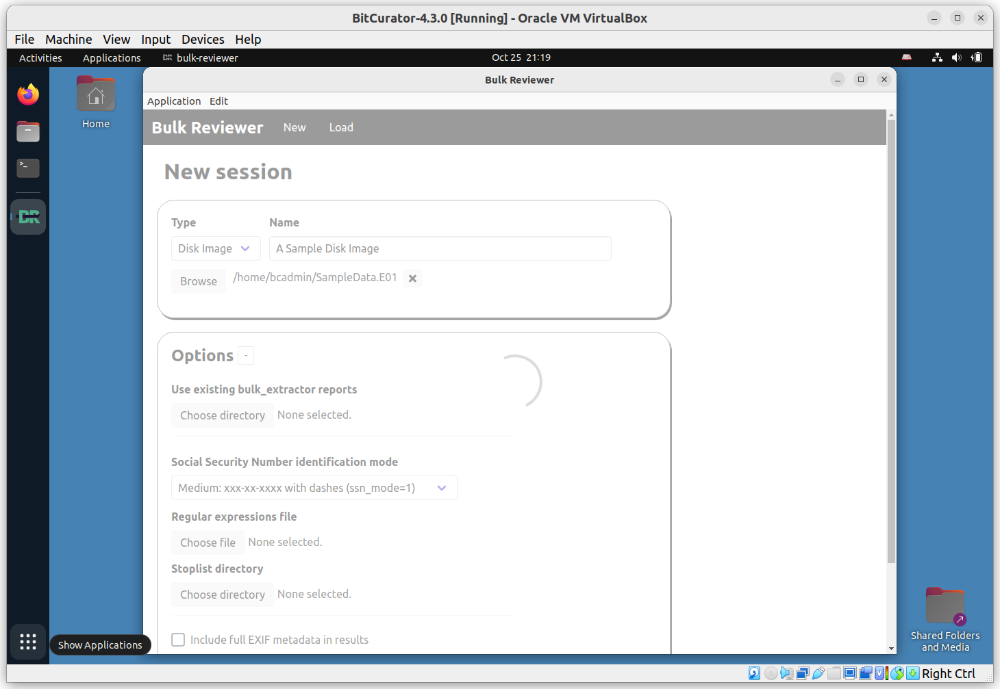
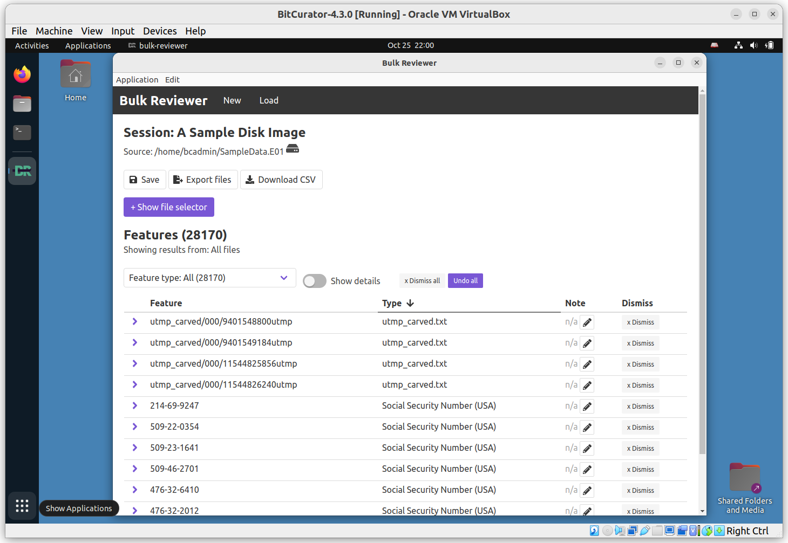

# Overview
BitCurator 4.x.x releases include Bulk Reviewer (version 0.3.1). Bulk Reviewer “is an Electron desktop application that aids in identification, review, and removal of sensitive files in directories and disk images. Bulk Reviewer scans directories and disk images for personally identifiable information (PII) and other sensitive information using [bulk_extractor](https://github.com/simsong/bulk_extractor), a best-in-class digital forensics tool.”

Click **Scan new directory or disk image**. On the following page, select **Disk Image** under **Type** and click **Browse** to add our `SampleData.E01` image. Enter a name; we’ll use A Sample Disk Image in this example. Click Options to view available options (consult the [Bulk Reviewer documentation](https://bulk-reviewer.readthedocs.io/en/latest/index.html) for additional details). We’ll use the default settings in this example. Scroll down and click **Start Scan**.

You will see a spinning progress indicator appear. If your disk image is large, the program may remain in this state for some time. (Tip: You can reduce the runtime of this program by generating the bulk_extractor reports ahead of time. Bulk_extractor provides dynamically updated estimates of completion time. See the next section for how to run bulk_extractor independently.)

This process will write a new bulk-reviewer directory to the base directory where our image is located. In our example, this directory contains another new directory, `/home/bcadmin/A\ Sample\ Disk\ Image_reports`, and logfile.

When the scan has completed, a new page will appear showing a navigable list of all discovered features. Consult the [Bulk Reviewer documentation](https://bulk-reviewer.readthedocs.io/en/latest/index.html) for additional information.
