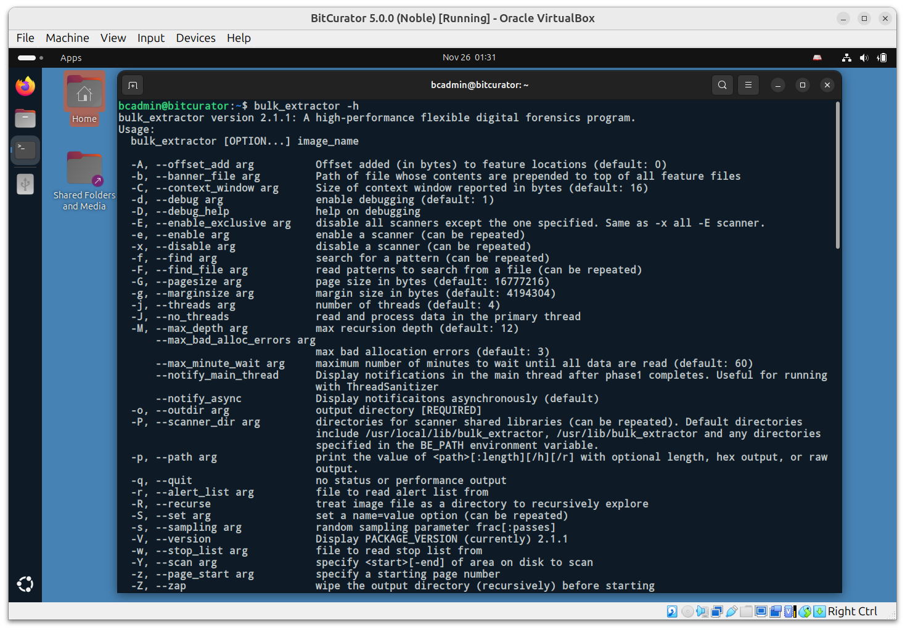
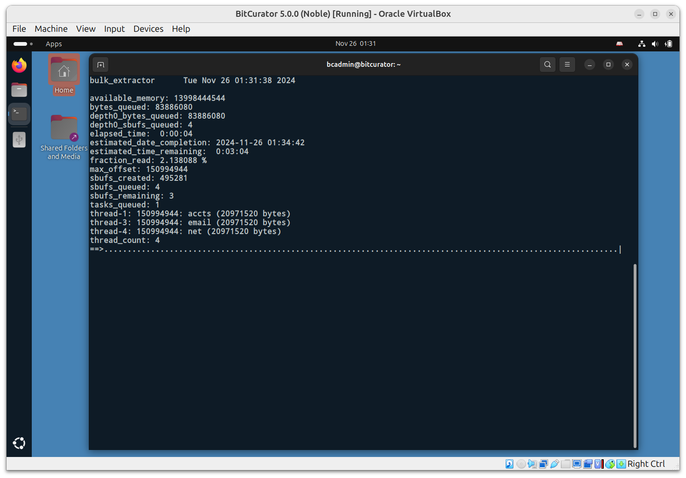
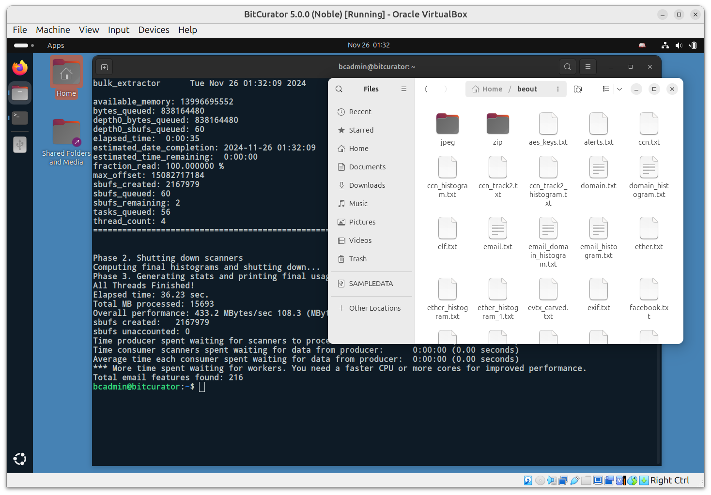
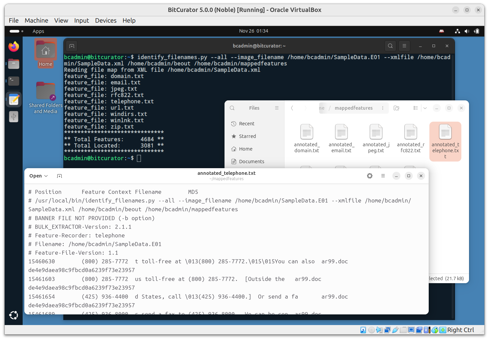

# Scanning Disk Images, Files, and Directories with bulk_extractor

BitCurator 5.x.x releases include bulk_extractor (version 2). The bulk_extractor tool “scans any kind of input (disk images, files, directories of files, etc) and extracts structured information such as email addresses, credit card numbers, JPEGs and JSON snippets without parsing the file system or file system structures. The results are stored in text files that are easily inspected, searched, or used as inputs for other forensic processing” (https://github.com/simsong/bulk_extractor/blob/main/README.md).

*Note: The 2.x releases of bulk_extractor do not include the BEViewer GUI front end.*

In this example, we will use the bulk_extractor CLI to analyze the EWF disk image (SampleData.E01) we created in an earlier step. Click on the Applications menu in the top left, navigate to the Forensics and Reporting submenu, and click bulk_extractor.

This runs the command `bulk_extractor –help`, displaying all the options available for the command. A full description of these options can be found in the `bulk_extractor` manual. For this simple test, we will **leave all of the default scanners on**, and specify only the required output directory, and the source material we wish to scan (our disk image). Enter the following command:

`bulk_extractor -o beout /home/bcadmin/SampleData.E01`

This tells `bulk_extractor` to write its output to a new directory beout in our current working directory (`/home/bcadmin`), and to scan the disk image found at `/home/bcadmin/SampleData.E01`. Once `bulk_extractor` begins running, the terminal will redraw to display a dynamically updated progress page:

Once the scan is complete, you will see a confirmation printed in the terminal with some statistics on the run. Click on the Files icon in the dock, and navigate to the beout directory in `/home/bcadmin`. 

This directory contains a range of items, including folders for JPEG images that have been carved out of the disk image, files that were extracted from zipped materials, and text file reports for each scanner that was run:

Note: The bulk_extractor tool does not parse the filesystem(s) contained within the disk image, so all features identified are referenced only by their byte offset into the source. If you wish to link specific features to the files they originated from within the filesystem(s), you will need to run the fiwalk tool to create a report of the filesystems, and the `identify_filenames` tool to map features in the bulk_extractor output to those filenames.

To run `fiwalk`, in the same terminal type:

`fiwalk -f -X /home/bcadmin/SampleData.xml /home/bcadmin/SampleData.E01`

This will create a new file, `SampleData.xml`, that contains a DFXML map of the filesystem(s) within the disk image.
Next, run the following command:

`identify_filenames.py --all --image_filename /home/bcadmin/SampleData.E01 --xmlfile /home/bcadmin/SampleData.xml /home/bcadmin/beout /home/bcadmin/mappedfeatures`

In order, the parts of this command tell the tool to process all feature files, use the image filename `SampleData.E01`, use the output from fiwalk, the location of the `bulk_extractor` output, and where to put our new output (a new directory named `mappedfeatures`).
Click on the Files icon in the dock, navigate to the `mappedfeatures` directory, and examine one of the files (in this example, we’re looking at `annotated_telephone.txt`). 

Compare this to the equivalent report in beout, and you will see there are now two new columns: the full file path of the file from which the feature originated, and the MD5 of that file.
