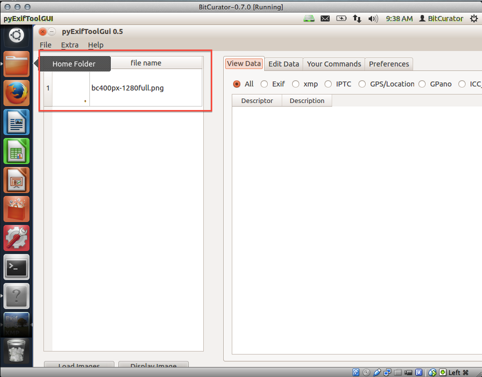

pyExifToolGUI
=============

As of February 5, 2020, pyExifToolGUI is no longer included in the BitCurator Environment (version 2.2.0 and beyond). It can still be installed in the environment - see the [project website](https://hvdwolf.github.io/pyExifToolGUI/) for more details.

### Overview

BitCurator includes Harvey Van Der Wolf’s [pyExifToolGUI](http://hvdwolf.github.io/pyExifToolGUI/), a front­‐end for ExifTool, to simplify the process of viewing, editing, and manually exporting data from select image files.

### Step-by-Step Guide

**Step 1:** Open PyExifToolGUI by double clicking on the "Forensics Tools" folder on the BitCurator desktop and then double clicking on the "PyExifToolGUI" icon (see Figure 1).

  
*Figure 1: Opening PyExifToolGUI.*  

**Step 2:**Click on "File" in the upper-left of the screen, then click on "Load Images" from the resulting drop-down menu (see Figure 2).

*Figure 2: Loading the image file.*

**Step 3:**Navigate to the image file in which you are interested, then click "open" in the bottom right-hand corner (see Figure 3). The image file you chose should now appear in the lefthand column of the screen (see Figure 4).

*Figure 3: Navigating to the image file.*

*Figure 4: The image file appears in the lefthand column.*

**Step 4:**Click on the image file name in the lefthand column; this will load information about the image in the right-hand side of the screen (see Figure 5). Browse through this data to discover information about the image such as date and time of its last modification, file size, and bit depth.

*Figure 5: Viewing information about the image file.*  

**Step 5:**The radio buttons above this data allow you to explore specific information about the image. For example, choosing the "GOS/Location" radio button would provide you with the GPS coordinates for where an image was take if they were available (in the example in Figure 6, no GPS coordinates were available for the image). | width="50%" style="vertical-align:top"   

  
*Figure 6: Using the radio buttons to further explore the image file.*  
  
  

**Step 6:**The tabs above the radio buttons provide additional options for exploring and editing your image file. The "edit data" tab is of particular interest (see Figure 7); this tab allows you to change the data saved to your image file, letting you (for example) add missing data known to you, such as the GPS coordinates of where an image was taken.  
  
*Figure 7: The "Edit Data" tab allows you to add or change data in the image file.*  

 If you would like to provide feedback for this page, please follow this [link to the BitCurator Wiki Google Form](https://docs.google.com/forms/d/e/1FAIpQLSelmRx1VmgDEg3dU5_8cXZy9MZ5v8_sAl-Ur2nPFLAi6Lvu2w/viewform?usp=sf_link) for the BitCurator All Step-by-Step Guides section.

