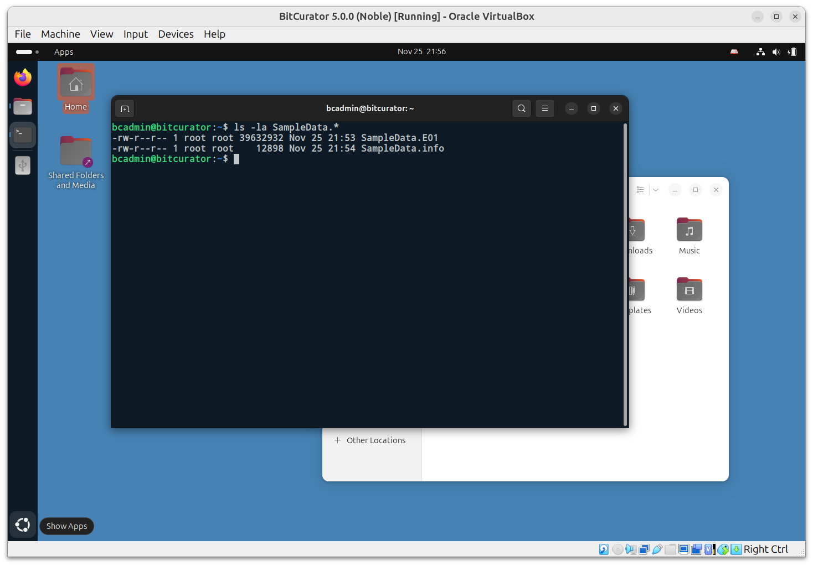

Imaging with Guymager
=====================

### **Overview**

The BitCurator environment includes [Guymager](https://guymager.sourceforge.io), an open-source, graphic application for creating disk images. Guymager supports the creation of raw (.dd) or Expert Witness Format (.E01) disk images. The Expert Witness Format is commonly used in the digital forensics community because it incorporates metadata about the original media into the disk image itself.

This Guide includes three sections: 
- Imaging Physical Media
- Changing Permissions for our Disk Image Files
- Mounting and Examining a Disk Image


## Imaging Physical Media

In this example, we will acquire a USB flash drive connected to a laptop running the BitCurator environment in a VirtualBox VM. The process is similar for other devices.


When properly configured (with VirtualBox Guest Additions installed and a USB Device Filter enabled for all USB devices in the VirtualBox settings for that machine), the USB device should be automatically captured by the VM. **However, it will not be automatically mounted.**

Mounting the device is not required to create an image of it. If you wish to mount the device, click on the **Files** icon in the dock, and select the name of the indicated volume on the device to mount. **If you are not using a hardware write blocker, or if the USB device read-only policy is not enabled, your device is now mounted and writable.** Read more about the BitCurator Environment mount policy here: [Set Mount Policy](docs/All Step-by-Step Guides/Imaging and Recovery Guides/Set Mount Policy.md)


Click on the **Applications** menu in the top left of the screen, then navigate to the Imaging and Recovery submenu. Then click on `Guymager`. Guymager requires elevated privileges for access to physical devices; you will be prompted for your password to enable this. Once Guymager has loaded, the main interface appears as in the picture above. In this example, the USB flash drive is selected.


Next, right-click on the selected device (in this example, a 16GB SanDisk Extreme flash drive) and select **Acquire Image** from the context menu. A new dialog will appear:


This disk image will be acquired using the Expert Witness Format (the second option at the top). Guymager will split EWF images into 2048MiB segments by default. If you do not wish to split the image, set the **Split size** to something very large (2 EiB, for example).

The five metadata fields starting with **Batch number** are optional. Don’t forget to select the directory you made on the desktop in the Image directory field. In this case, we have simply chosen to write the image to our home directory. Finally, provide a name for the image. Then click **Start**.


You will see the main dialog state change to Running. When the acquisition finishes, you will see a **Finished - Verified & Ok** message in the State column.

*Tip: If you’re running the BitCurator environment in a VM, the default screen resolution may be small enough that you can’t see the whole dialog. Increase the size of your VM window by dragging a side or corner. The desktop should adjust automatically.*

Close Guymager, and double-click on the **Home** icon on the Desktop. If your physical device is mounted, it will appear in the window with an eject symbol next to it.


## Changing Permissions for our Disk Image Files

Since Guymager runs with elevated permissions, the images it creates are **read-only** for users other than **root**. Double-click on the **Home** icon on the Desktop. You will see that the image file (and associated metadata file) we have created have small **“locked padlock” indicators** on them, indicating restricted permissions for our user.


If you’re unfamiliar with how Linux permissions work, now is a good time to read an introductory guide such as the one at [The Linux command line for beginners](https://ubuntu.com/tutorials/command-line-for-beginners).

There are multiple ways to update the permissions on these images so we have full read-write access, but the fastest is with some terminal commands. Right-click in the white space of the window we just opened, and select **Open in Terminal** from the context menu.

In the Terminal window that appears, type the following:

`ls -l SampleData.*`

This tells the system to list, using the long listing format (`-l`) files with the name SampleData and any extension.



We can see that these two files have read-write permissions for the file owner (root), read-only permissions for the group owner (anyone part of the root group) and read-only permissions for all other users. We could change these permissions so that everyone has read-write access, but instead for this example we will be changing the file owner and group owner to our user, bcadmin. To do this, enter the following commands:

```
sudo chown bcadmin SampleData.*
sudo chgrp bcadmin SampleData.*
```
If you run the previous ls command again, you’ll see that the file owner and group owner for both of the SampleData files is now bcadmin. The padlock icons are also now gone in the file manager window. Close the terminal window.

## Mounting and Examining a Disk Image

The BitCurator environment includes many different tools to interact with disk images. For raw (`.dd` or `.raw`) and Expert Witness Format (`.E01`) images that contain filesystems readable by the underlying Ubuntu OS, BitCurator includes some convenience scripts to automatically mount those filesystems.


In the file manager dialog, right click on the SampleData.E01 image we created, select Scripts, and then select Mount Disk Image (imount). This script serves as a wrapper for imagemounter, a tool that will attempt to automatically mount any identified file systems.


A pop-up window will appear showing the commands that imount has attempted to use to mount the image. If an exception occurs, no mount will occur. If such a filesystem is found, you will see it appear as a mountable device in the location bar of the window. Click **OK** to proceed.

*Note: Previous versions of BitCurator used the fmount tool for the Disk Image Mount and Unmount menu items. These can still be found in the Legacy Mounter submenu under scripts when right-clicking on an image file.*


In this example, we have mounted the FAT32 filesystem contained within the image of the 16GB drive we imaged, and can now browse, open, and copy any files we require. In this example, we have opened a PPTX file in LibreOffice.

Note: This mount is read-only. You cannot alter the content of a filesystem mounted from an E01 file (modifying, adding new files, or deleting) from this desktop interface.

Once you have finished examining the content, click the eject indicator next to the filesystem name in the file dialog. You will get a prompt for your user password in order to complete this step.

Next: [Analyzing a Disk Image with Brunnhilde](docs/All Step-by-Step Guides/Forensics and Reporting Guides/Analyzing a Disk Image with Brunnhilde.md)

