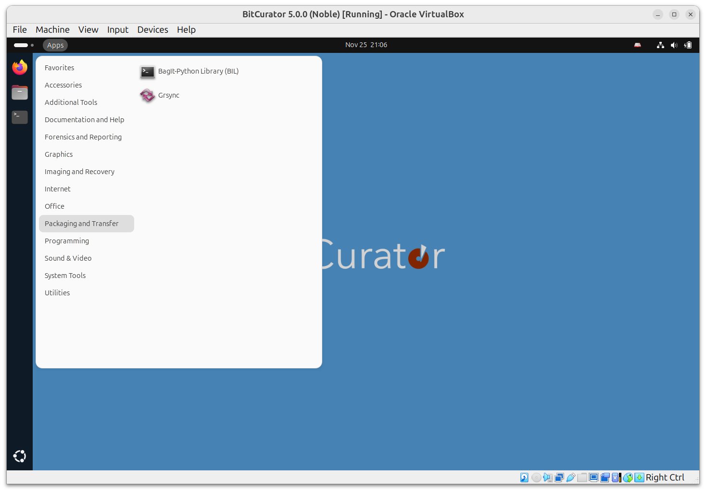

Packaging and Transfer Guides
=============================

### Overview

Guides for preparing and packaging born-digital materials for transfer to preservation storage and access platforms.  

The Packaging and Transfer submenu lists some tools to assist with safe packaging and network transfer of materials. These include:

* **Bagit-Python**: A Python library and command line utility for working with [BagIt](http://purl.org/net/bagit) style packages.
* **Grsync**: A GUI front-end for rsync.

### Guides

- [Creating BagIt Packages for Secure Transfer with BagIt-Python](Creating BagIt Packages for Secure Transfer with BagIt-Python)
- [Share files to and from the BitCurator Environment](Share files to and from the BitCurator Environment)

  

