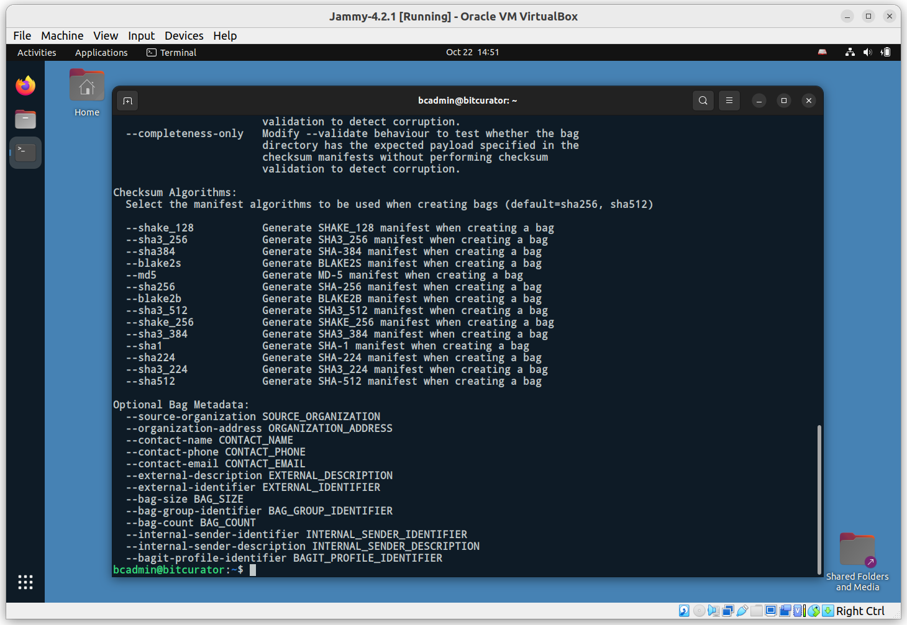
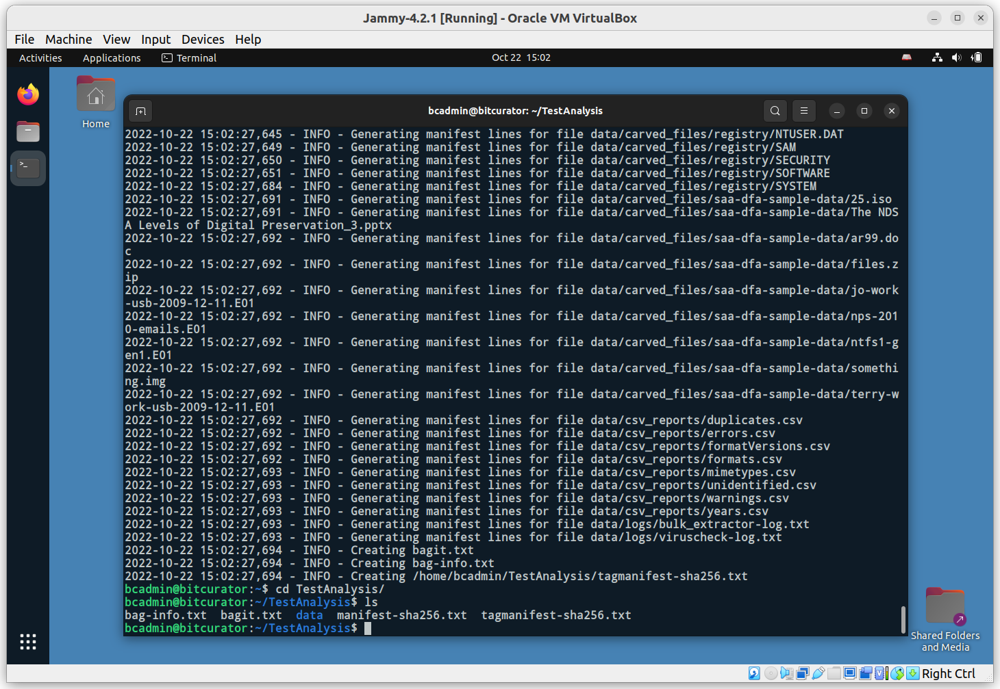

# Overview
BitCurator 4.x.x includes the latest release of bagit-python, a simple command line tool to create BagIt-style packages to facilitate data transfer.

To see the help options for bagit-python, click the Applications menu in the top left, navigate to Packaging and Transfer, and click Bagit-Python Library (BIL). A new terminal window will open:

The bagit.py command has many available options. Consult the [README](https://github.com/LibraryOfCongress/bagit-python) for a detailed explanation. For this simple example, we will create a bag that includes a metadata identifier for the source organization, specifies that we will use the SHA256 hash algorithm, and that we are creating a bag of the TestAnalysis directory we created in the Brunnhilde exercise:

`bagit.py --source-organization “BitCurator” --sha256 /home/bcadmin/TestAnalysis`

Note: This will perform a “bag in place” operation, which rebuilds the original TestAnalysis directory, moving its content into a data subdirectory and writing out the relevant bagit metadata into a selection of new files:

Navigating into the TestAnalysis directory on the command line, and listing the content, we can see the result of the bag creation operation.
