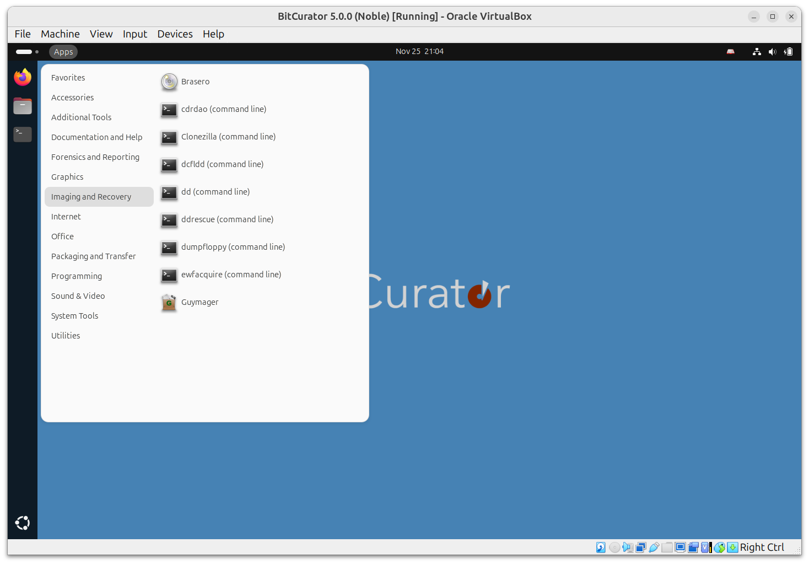
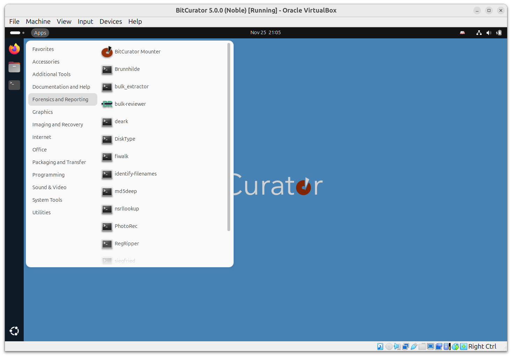
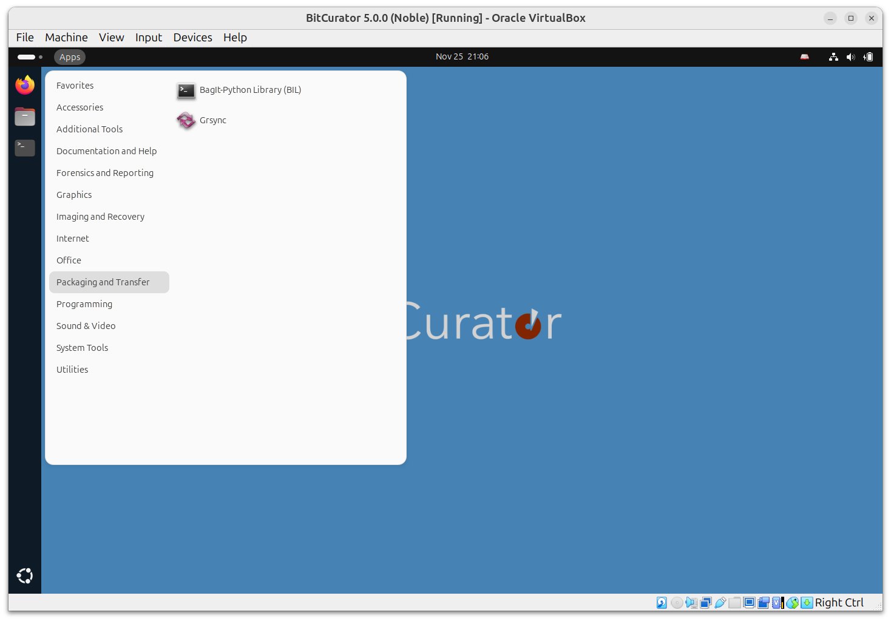
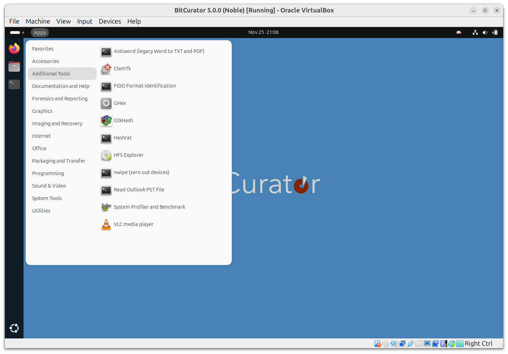

Working in the BitCurator Environment
==============================

The BitCurator Environment includes various customizations and tools to assist in mounting and analyzing digital media and their contents. When you log in, you should see a desktop similar to the one shown below:

In previous releases, tools to support a variety of workflows were organized into folders on the desktop. In BitCurator 5.x, these tools are organized in submenus under the Applications menu in the top left (to the right of the Activities menu).

### Imaging and Recovery submenu:

### Forensics and Reporting submenu:

### Packaging and Transfer submenu:

### Additional Tools submenu:

To read more about any of these tools, navigate to the Step by Step Guides for each category.
