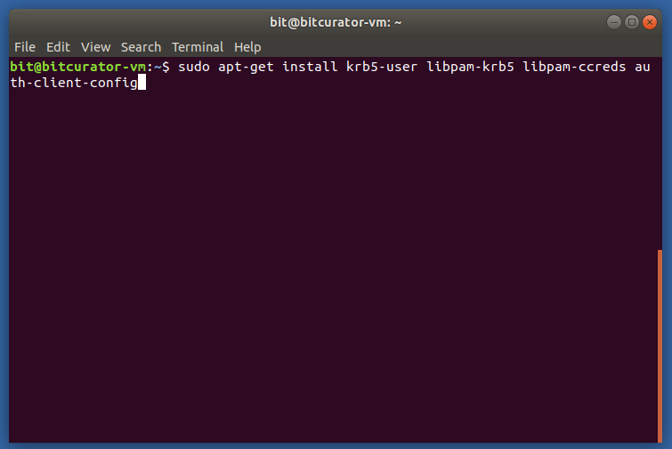
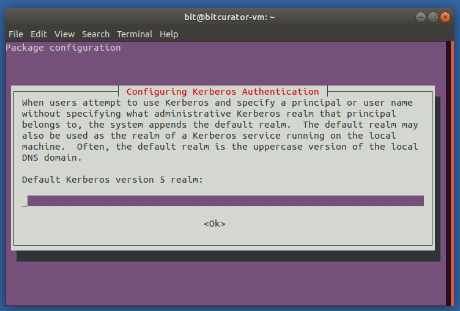
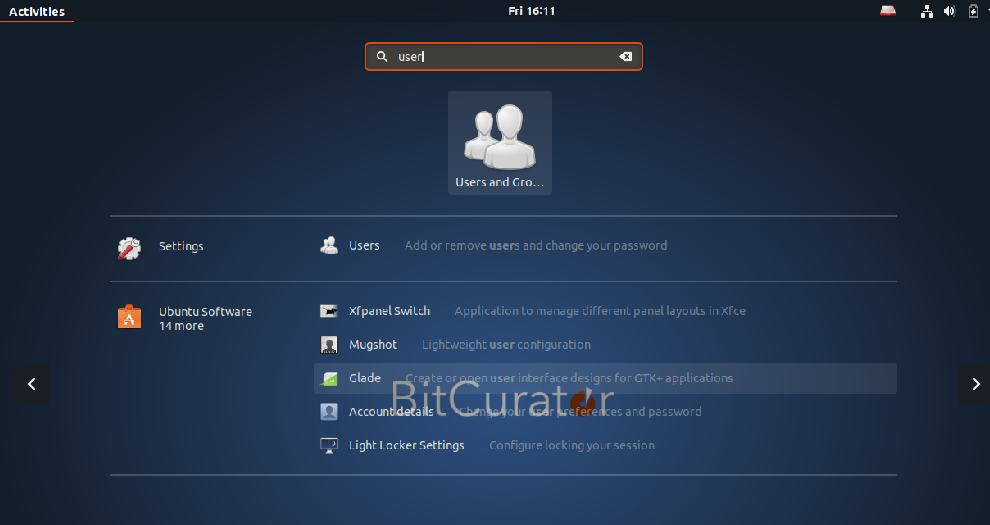
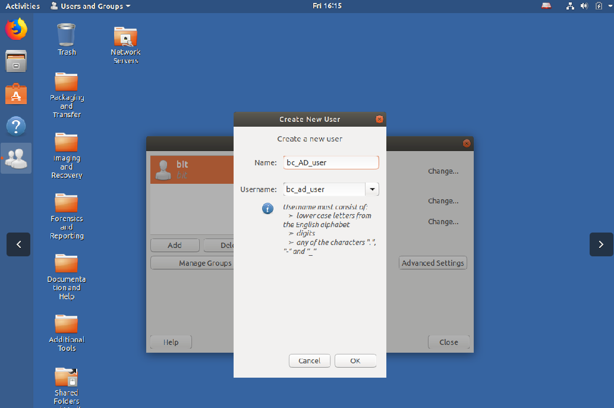
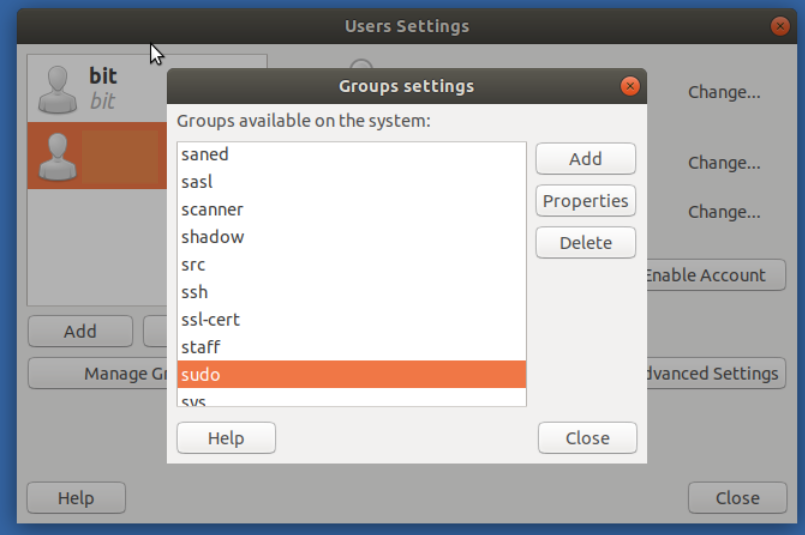

Configuring BitCurator to enable users to authenticate with Active Directory accounts
=====================================================================================


**Overview:**

Active Directory is a service used by many institutions to provide authentication and authorization of users in a Windows Domain type network.  The below instructions describe how to configure BitCurator installations to enable multiple user accounts and to enable users to authenticate with accounts that are managed by Active Directory.  The result will allow users to login to the BitCurator environment using their centrally managed password.

  


Step-by-step guide
------------------

**Step 1**:  Active Directory services are an implementation of the open source Kerberos 5 protocol. Installation of Kerberos client software enables the use of Active Directory for BitCurator. 

  


From within BitCurator open the terminal by pressing `CTRL + ALT + t` and enter the following command to install the needed software:

`sudo apt-get install krb5-user libpam-krb5 libpam-ccreds auth-client-config`

Enter your user password when prompted.

  





**Step 2:**

When prompted, enter the URI of the Active Directory server that you will be connecting to.  Example: `AD.TEST.ORG`

  


The Active Directory server used in your institution can be found from a currently logged in Windows system:

* From the Windows desktop, right click on the **Computer**icon
* Select **Properties**
* Look under the **Computer name, domain, and workgroup settings** for an entry that look similar to:
	+ Domain: ad.yourinstitution.edu

  


  





**Step 3:**

After installing the Kerberos software, we will use the Users and Groups application add the users that will be using Active Directory for authentication.  Press the SUPER key and start typing "Users and Groups", select the icon once it appears.

  


  


Click the button for 'Add' to add a new user to the installation.  When prompted, enter the Active Directory username in both the Name and Username boxes (username and name must be the same).  When prompted to set a password, click cancel.  The password for the account will be managed by the Active Directory service.

  


  


  


  


  


  


  




  





**Step 4:**

The newly created user will need to be added sudo group.  With the user highlighted in the left column, click the Manage Groups button, check the necessary groups, and click Ok.





**Step 5**:

Install BitCurator tools for newly created user following using the [bitcurator-distro-installer](https://github.com/bitcurator/bitcurator-distro-installer).  If not already installed, follow the [linked instructions](https://github.com/bitcurator/bitcurator-distro-installer#simple-install) for cloning the installation files.

For each new user enter the following command in the Terminal:


```
sudo ./install.sh -u username  
  

```


  


