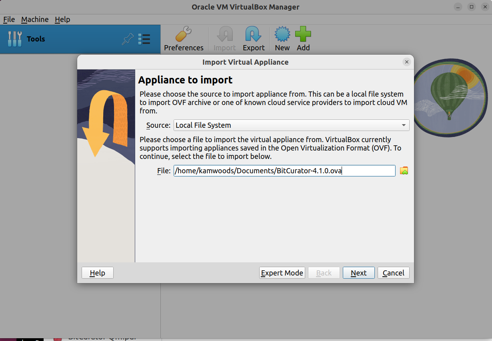

Import a BitCurator Virtual Appliance in VirtualBox
---------------------------------------------------------------

## Importing the BitCurator Virtual Appliance
For some releases of BitCurator, a preconfigured Virtual Appliance (`.ova`) file may be available. Virtual Appliance files can be quickly imported into VirtualBox with minimal additional configuration. Visit [https://github.com/BitCurator/bitcurator-distro/wiki/Releases](https://github.com/BitCurator/bitcurator-distro/wiki/Releases) to see if a Virtual Appliance is available for one or more recent releases. To import, start VirtualBox on your host and select **Import Appliance** in the File menu.

Click on the folder icon, navigate to the location of your downloaded file, select it, and then click **Next**.

Importing the appliance may take several minutes. Once the import has been completed, you may wish to check the Settings for the machine. By default, it is configured with 4GB RAM and 2 Processor Cores. We recommend increasing this to at least 8GB and 4 Processor cores, if your hardware is capable.

Start the machine and continue with the section [Working in the BitCurator Environment](Working in the BitCurator Environment).
