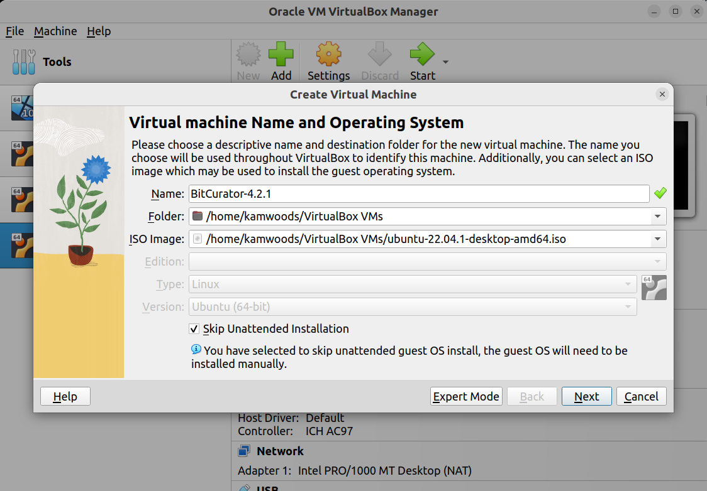
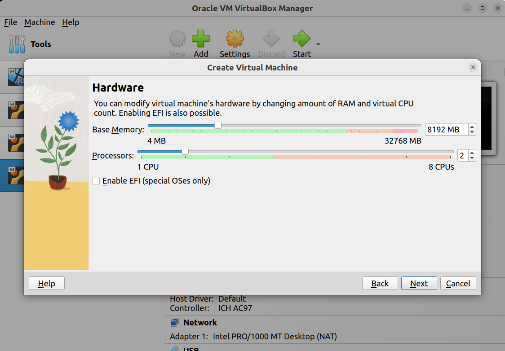
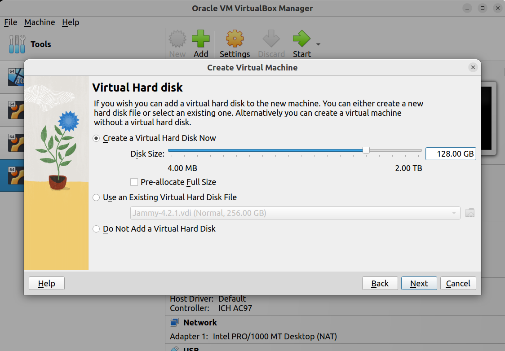
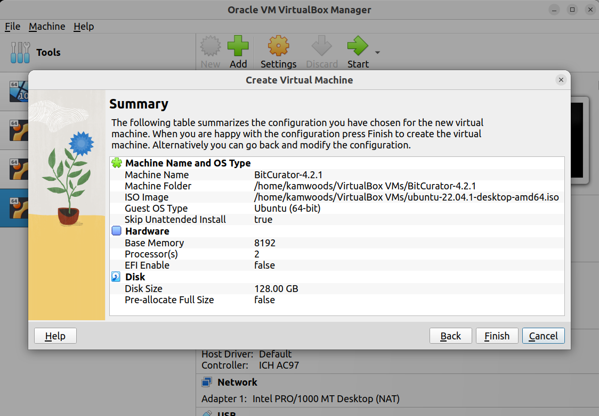
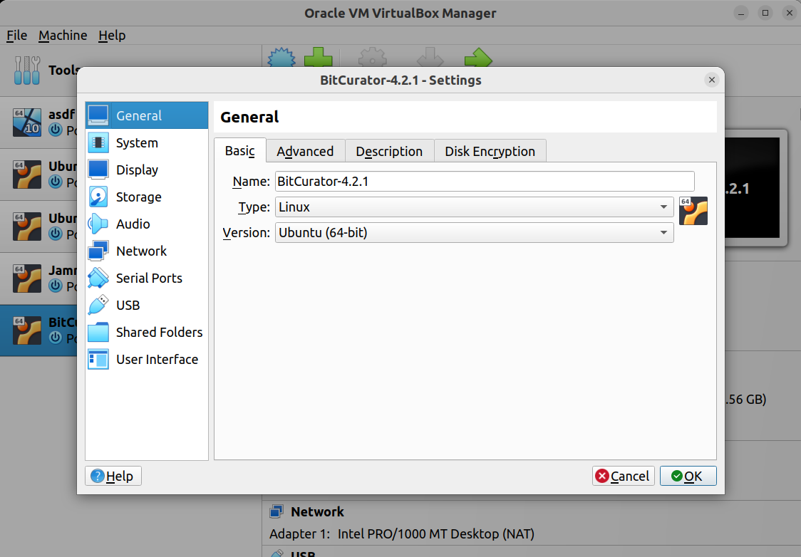
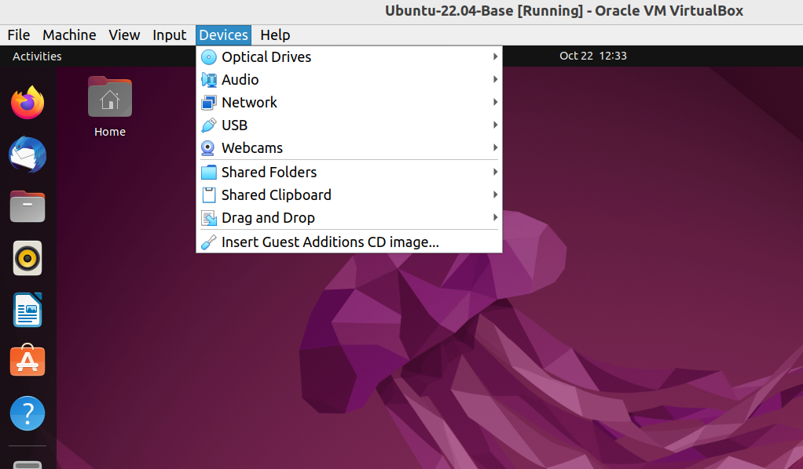

Install Option 2: Installation via Virtual Machine
================================

### Overview

Using the BitCurator Environment through a virtual machine allows you to install the software as another program on an existing computer. This can be very useful for both testing the software and instruction. It is also helpful if you do not have access or the ability to install directly on a drive. However, if you anticipate using the software regularly or routinely, it is best to arrange for a dedicated install. 

Hardware Requirements

* Desktop or laptop with an Intel Core i7 (or similar) processor running 64-bit Windows 7/8/8.1/10, macOS 10.10 (or newer), or a 64-bit Linux variant
* 8 GB RAM or more
* 12 GB free hard disk space minimum. The virtual machine is approximately 9 GB. It will expand to 256 GB as needed

## Install Ubuntu 22.04LTS
Download the latest 64-bit Ubuntu 22.04 desktop image from [https://releases.ubuntu.com/22.04/](https://releases.ubuntu.com/22.04/).

**If you are installing Ubuntu 22.04LTS in new VirtualBox VM**, review the instructions in section Important Notes for VirtualBox VM Installations. You may (optionally) replicate the default user and machine name for BitCurator: when prompted use `BitCurator` for **Your name**, `bitcurator` for **Your computer’s name**, and `bcadmin` for **Pick a username**. Enter a strong password of your choice. When the installation is complete, reboot, log in, and continue with the instructions in section [Install BitCurator in Ubuntu 22.04LTS](#install-bitcurator-in-ubuntu-2204lts).

### VirtualBox VM Installations
Visit the [VirtualBox](https://www.virtualbox.org/wiki/Downloads) website to download and install the latest version of VirtualBox for your machine. You must also install the **VirtualBox Extension Pack** on your host machine in order for USB 3.0 support to work. Note that installation options have changed in VirtualBox 7.x and later. In the VirtualBox VM Manager, after clicking New to create a new VM, you must specify the name for your VM, the location of the Ubuntu ISO you downloaded earlier, and check the box for **Skip Unattended Installation**.

Click **Next**, and on the following screen select **at least 8GB RAM and 2 processor cores**:

Click **Next** and set the size of the virtual disk. **We recommend at least 128GB**:

Click **Next**, and review the details:

Now, click **Finish**, and you will be returned to the main management interface. With your new image selected, click Settings:

In Settings, you will need to make several modifications:

- In the **General -> Advanced** tab, change **Shared Clipboard** to **Bidirectional** and **Drag ‘n Drop** to **Host to Guest**.
- In the **Display -> Screen** tab, **increase the Video Memory to 128MB**.
- In USB, ensure that **Enable USB Controller** is checked, select the **USB 3.0 (xHCI) Controller**, and **click the small blue USB plug icon** on the right hand side of the dialog to create a new USB filter. Click **OK**.

With the machine selected, click **Start**, and proceed with the Ubuntu installation as normal.

Once you have completed installing Ubuntu in a VirtualBox virtual machine, it’s a good time to **install the VirtualBox guest additions**, since both media automounts and software autorun will be disabled after deploying the BitCurator install script in the next section. First, you must install some package so that the guest additions can be built as a kernel module. Open a terminal and run the following commands:

`sudo apt-get update && sudo apt-get upgrade -y
sudo apt-get install build-essential gcc make perl dkms
sudo reboot`

Once the machine has rebooted, log in and select **Insert Guest Additions CD Image** from the **Devices** menu:

Now, **click the Files icon in the dock**, and you should see the Guest Additions CD listed on the left of the new window. Click it, and in the new dialog select **Run Software**.

**Important**: If you have trouble getting the VirtualBox guest additions automatic installer to run, you can also execute the following command from a terminal with the guest additions ISO mounted (replacing X.X.X with the current release number of the guest additions you are using; this number will match the release number of VirtualBox itself):

`sudo /media/bcadmin/VBox_GAs_X.X.X/VBoxLinuxAdditions.run`

(**Note**: as you are typing, you can hit the Tab key on your keyboard to autocomplete each part of the command after typing a few letters) If you plan to use Shared Folders, you should also add the bcadmin user to the vboxsf group in Ubuntu (after the guest additions have been installed). To do this:

Install the gnome-system-tools package in order to access the Users and Groups GUI. In a terminal, run the following command:

`sudo apt-get install gnome-system-tools`

Click on the Show Applications icon (grid icon) at the bottom left of the screen. then type “Users and Groups”. Click on the icon that appears in the search results.

Click **Manage Groups** for the **bcadmin** user

Scroll down the groups list until you see **vboxsf**. Select it and click **Properties**.

**Enable the checkbox**.

Click **Ok**. You will be prompted for the password for the `bcadmin` user. Once you’ve completed this step, you can close the Users and Groups window.

Continue by following the instructions in the section [Install BitCurator in Ubuntu 22.04LTS](#install-bitcurator-in-ubuntu-2204lts).

### Install BitCurator in Ubuntu 22.04LTS

**1. Prepare your environment**

To ensure you have all of the tools, and updates necessary for the BitCurator environment to succeed, you should update the local apt repository and install the necessary tools. Open a terminal and use the following commands:

`sudo apt-get update && sudo apt-get upgrade -y
sudo apt-get install gnupg curl git -y`

`gnupg` is required for the BitCurator installer to validate the signature of the BitCurrator configuration files during install. `curl` can be used when developing or testing state files. `git` is used to clone local GitHub repos, and can be used when testing state files from the [BitCurator SaltStack Repo](https://github.com/bitcurator/bitcurator-salt).

**2. Download the BitCurator CLI installer**

BitCurator uses a standalone command-line tool for installation and upgrade. First, open a terminal and download the latest release of the tool with the following command:

`wget https://github.com/BitCurator/bitcurator-cli/releases/download/v1.0.0/bitcurator-cli-linux`

Verify that the SHA-256 has of the downloaded file matches the value below:

`5acab7abcafa24864d49e4872f8e2b562c16bf4842256ad3f994aae8d0df77c1`

You can generate the hash of your downloaded file with:

`sha256sum bitcurator-cli-linux`

Next, adjust some permissions and move the BitCurator installer to the correct location:

`sudo mv bitcurator-cli-linux /usr/local/bin/bitcurator
sudo chmod +x /usr/local/bin/bitcurator`

**3. Run the BitCurator CLI Installer**

**Simple install**: Run the BitCurator installer. This may up to an hour to complete, depending on your system and network speeds:

`sudo bitcurator install`

The command will install BitCurator for the user that is currently logged in. For other installation options, read the section below.

**Optional install modes**:

The BitCurator installer provides several additional installation modes. To see the options provided by the command, run the following:

`bitcurator --help`

You will be presented with the usage information:

`Usage:
  bitcurator [options] list-upgrades [--pre-release]
  bitcurator [options] install [--pre-release] [--version=<version>] [--mode=<mode>] [--user=<user>]
  bitcurator [options] update
  bitcurator [options] upgrade [--pre-release] [--mode=<mode>] [--user=<user>]
  bitcurator [options] version
  bitcurator [options] debug
  bitcurator -h | --help | -v
Options:
  --dev                 Developer Mode (do not use, dangerous, bypasses checks)
  --version=<version>   Specific version install [default: latest]
  --mode=<mode>         bitcurator installation mode (dedicated or addon, default: dedicated)
  --user=<user>         User used for bitcurator configuration [default: bcadmin]
  --no-cache            Ignore the cache, always download the release files
  --verbose             Display verbose logging`
  
If you wish to install BitCurator for a different user, you may use the following command:

`sudo bitcurator install --user=<user>`

Where `<user>` is a username other than the one you are currently logged in as.

If you wish to install BitCurator in addon mode (installing the tools, but leaving the default Ubuntu theme intact), use the following command:

`sudo bitcurator install --addon`

**3.1 What to do if something goes wrong**

If you encounter an error, you may be able to identify the issue by reviewing the `saltstack.log` file under `/var/cache/bitcurator/cli` in the subdirectory that matches the BitCurator state-files version you're installing. Search for the log file for “`result: false`” messages and look at the surrounding 5 lines or the 8 lines above each message to see the state file that caused the issue. You can do this with:

`grep -i -C 5 'result: false' or grep -i -B 8 'result: false'`

**4. Reboot**

When the installation is complete, reboot your system from the terminal:

`sudo reboot`

After the reboot, you will be automatically logged in if you selected “Automatic Login” during the Ubuntu install. Otherwise, you can log in to BitCurator with the username and password used during the install. To change this behavior:

1. Open the **Activities** overview and start typing Users.
2. Click **Users** to open the panel.
3. Select the user account that you want to set the log in behavior for at startup.
4. Press **Unlock** in the top right corner and type in your password when prompted.
5. Switch the **Automatic Login** switch to on or off, depending on the desired behavior.

