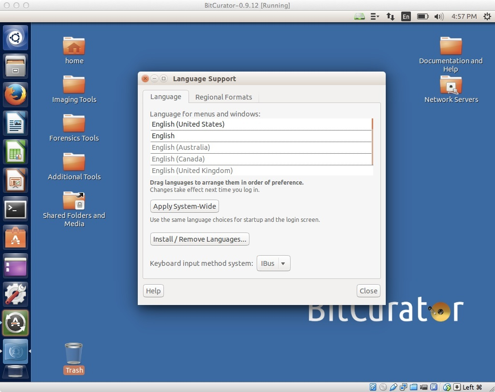
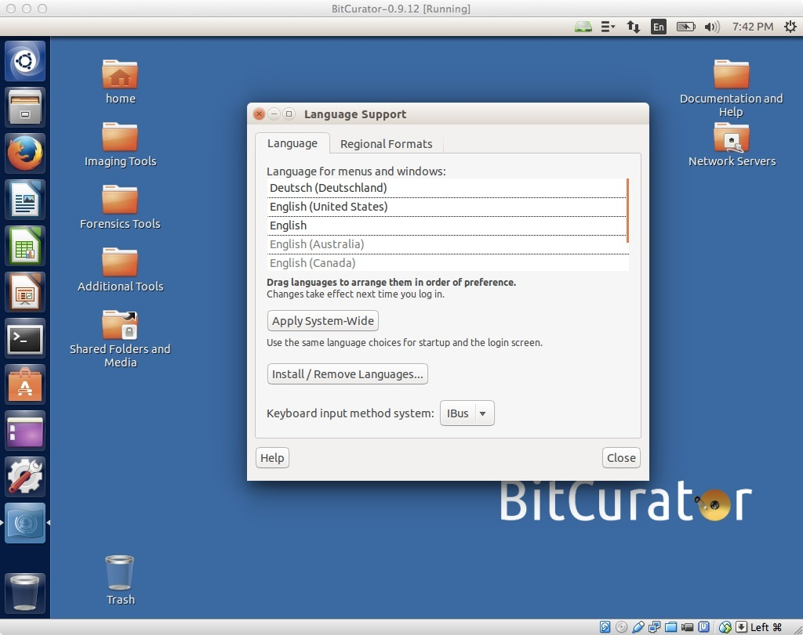

Internationalization and Ubuntu
===============================

Language Support in Ubuntu
--------------------------

The BitCurator environment is built using Ubuntu 16.04LTS, which has extensive support for a wide range of languages. However, language support packs are large. To keep the installation ISO and virtual environment small, we distribute BitCurator with only the English (US) language pack installed. Installing additional language packs is easy using the following steps. First, open the Ubuntu System Settings window by clicking on "System Settings" in the top right-hand icon in the menu bar at the top.

**Figure 1**: Entering the system settings

Starting the Language Support Tool
----------------------------------

Once in the System Settings window, click on the "Language Support" icon to enter the Language Support tool. You will see a warning indicating "The language support is not installed completely." Click "Install", and you will be prompted for the password (which in the BitCurator environment is "bcadmin").

**Figure 2**: Opening the Language Support tool.

**Figure 3**: Authenticating to install.

  

Selecting a language to be installed
------------------------------------

When language support has finished installing, you'll see a window that looks like Figure 4. Click on "Install/remove languages", and in the following window select your desired language(s) (in Figure 4, we've selected "German"). **Click "Apply changes", and the language pack should be installed.** Make sure you're connected to the internet - the language packs can't be downloaded otherwise!

**Figure 4**: Main language settings window.

**Figure 5**: Selecting a language to install.

Selecting a system-wide application and menu language
-----------------------------------------------------

Now that the language pack has been installed, you'll need to drag your language of choice **above** any entries for English. Here, we've pulled the new **Deutsche** entry up to the top. Now, you'll need to log out, log back in again, and the environment should appear natively in your language of choice.

**Figure 6**: Language dragged to top of list and selected.

  

 If you would like to provide feedback for this page, please follow this [link to the BitCurator Wiki Google Form](https://docs.google.com/forms/d/e/1FAIpQLSeW9_Ri9tzXzisgBzQ26o4Ea4moDYmcKZ_f1qd9s4Ju17Yf_w/viewform?usp=sf_link) for the Installing BitCurator section.

