Migrating BitCurator VirtualBox VM to Hyper-V
=============================================

### Overview

These instructions were provided by Shelly Black, North Carolina State University Libraries.

Note that VirtualBox VM is a cross-platform virtualization application and Hyper-V cannot handle non-Windows operating systems. 

### System Requirements for Hyper-V

The Hyper-V role can be enabled on these versions of Windows 10:

* Windows 10 Enterprise
* Windows 10 Pro
* Windows 10 Education

The Hyper-V role cannot be installed on:

* Windows 10 Home
* Windows 10 Mobile
* Windows 10 Mobile Enterprise

Not a complete list, but the following items are necessary according to [Hyper-V documentation from Microsoft](https://docs.microsoft.com/en-us/virtualization/hyper-v-on-windows/reference/hyper-v-requirements):

* 64-bit Processor with Second Level Address Translation (SLAT).
* CPU support for VM Monitor Mode Extension (VT-x on Intel CPU's).
* Minimum of 4 GB memory.

The following items will need to be enabled in the system BIOS:

* Virtualization Technology - may have a different label depending on motherboard manufacturer.
* Hardware Enforced Data Execution Prevention.

### Migration Instructions

1. Download BitCurator VM and Oracle Virtualbox, plus VirtualBox Extension Pack, and ensure BitCurator opens in VirtualBoxSee [installing BitCurator via virtual machine instructions](/documentation/BitCurator Environment/Installing BitCurator/Installation via Virtual Machine)2. Export .vbox to .ova using VirtualBox (“Write Manifest file” and “Include ISO image files” should be checked)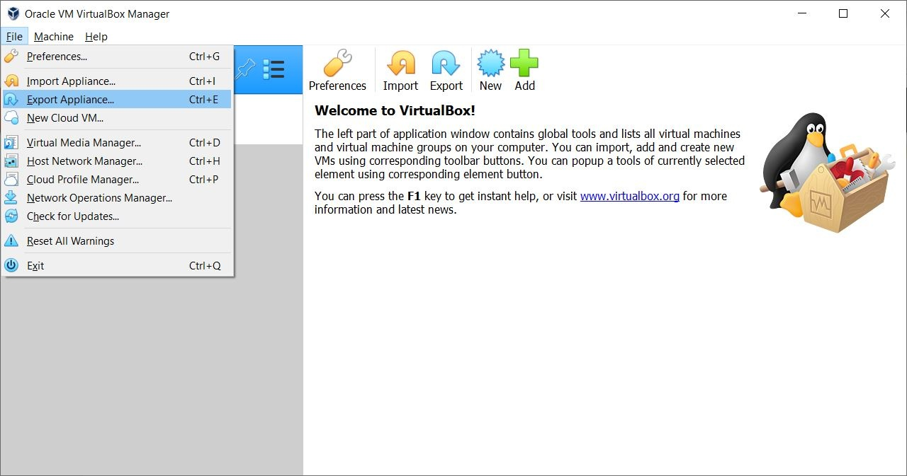

*Figure 1*: Within File, navigate to Export Appliance

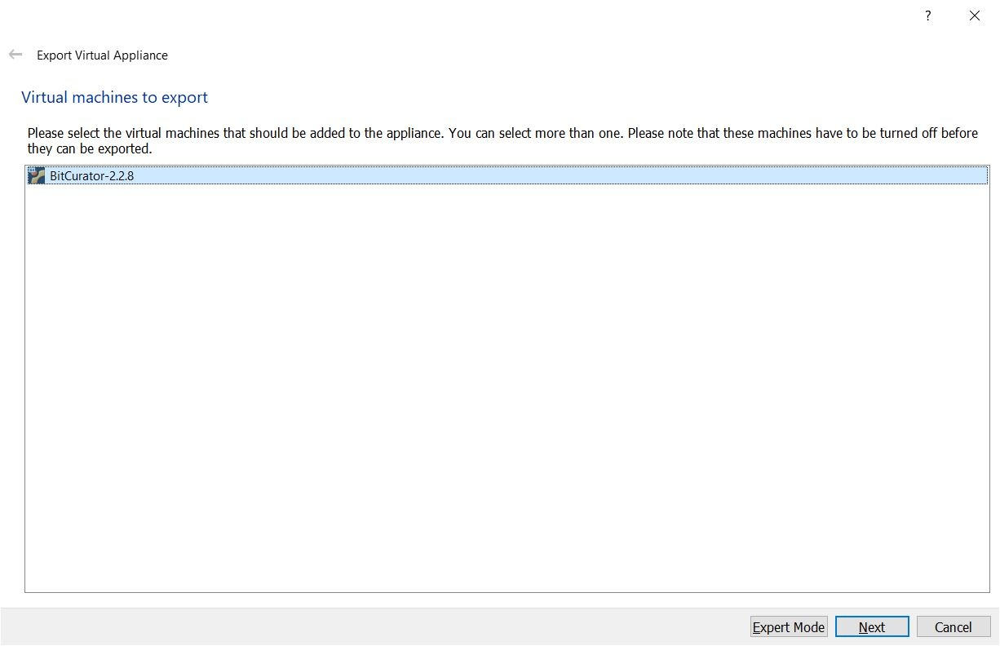

*Figure 2*: Select the BitCurator VM

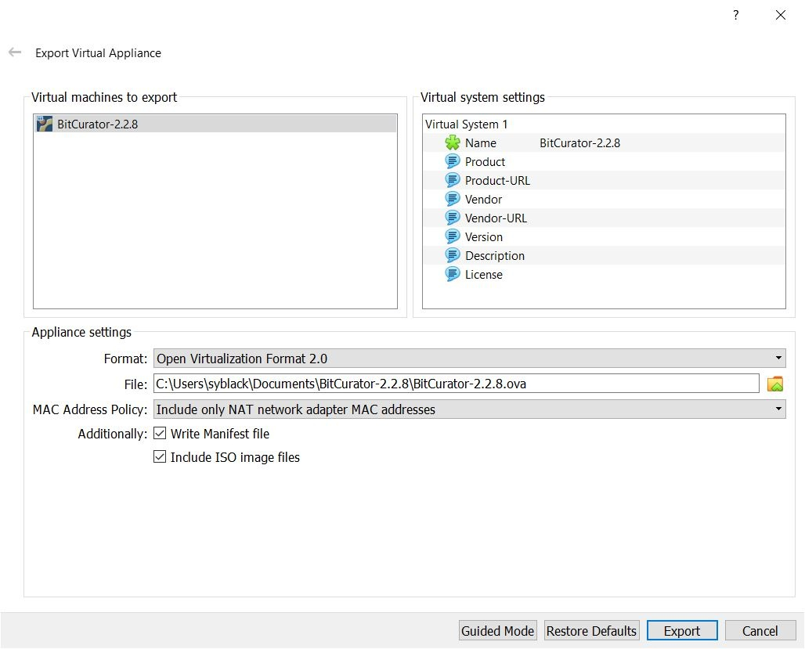

*Figure 3*: "Write Manifest file" and "Include ISO image files" should be checked

3. Extract .ova in Terminal`tar -xvf BitCurator-2.2.8.ova`

4. Convert .vmdk to .vhdx growable image using Starwind V2V ConverterUse [Starwind V2V Converter](https://www.starwindsoftware.com/converter), a tool for cloning and transforming VMs from one format to another.  

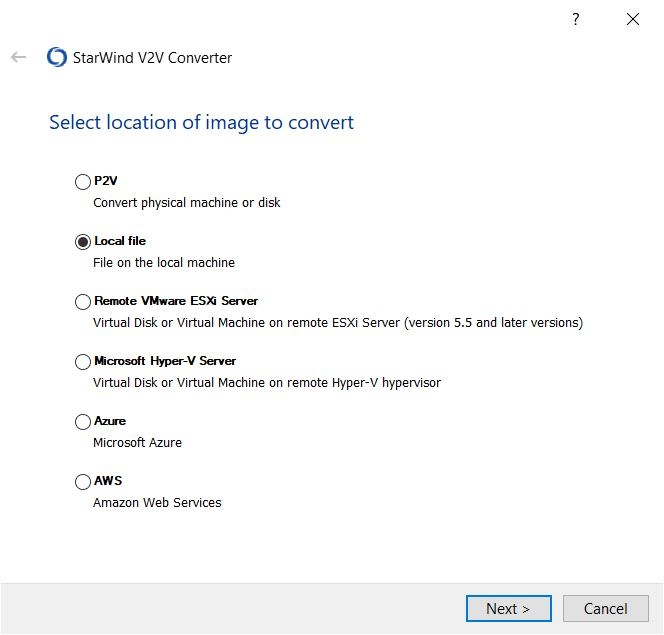

*Figure 4*: Select local file as location of image to convert

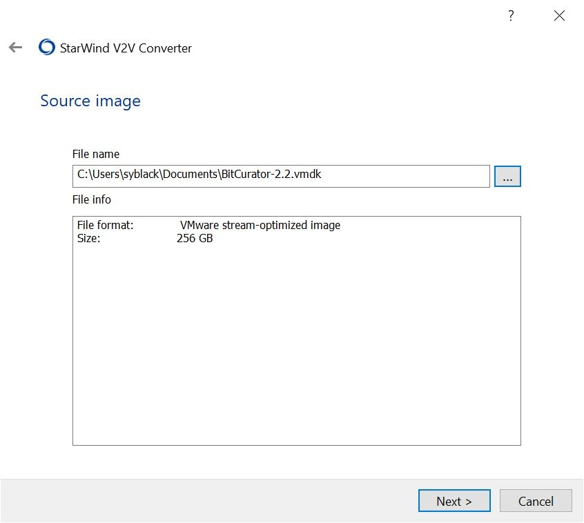

*Figure 5*: Select file name and file info

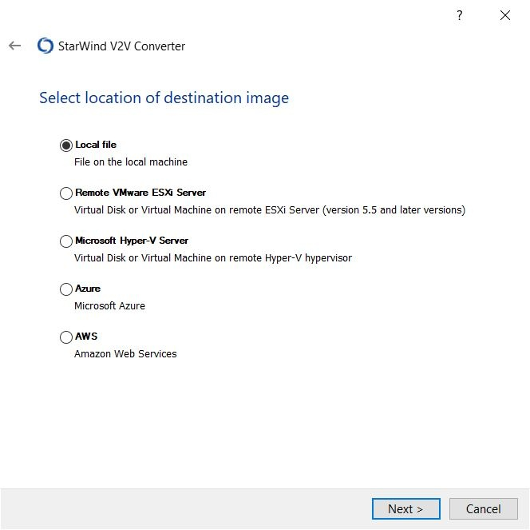

*Figure 6*: Select local file as location of destination image

  

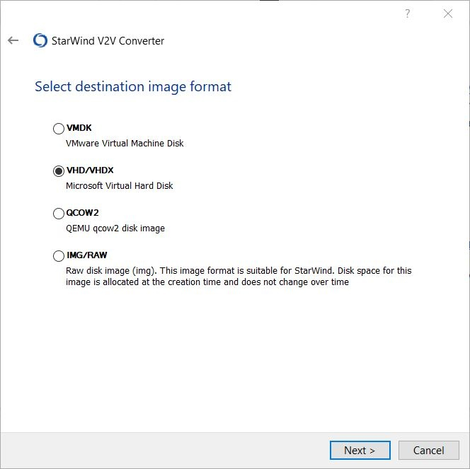

*Figure 7*: Select VHD/VHDX Microsoft Virtual Hard Disk as destination image format

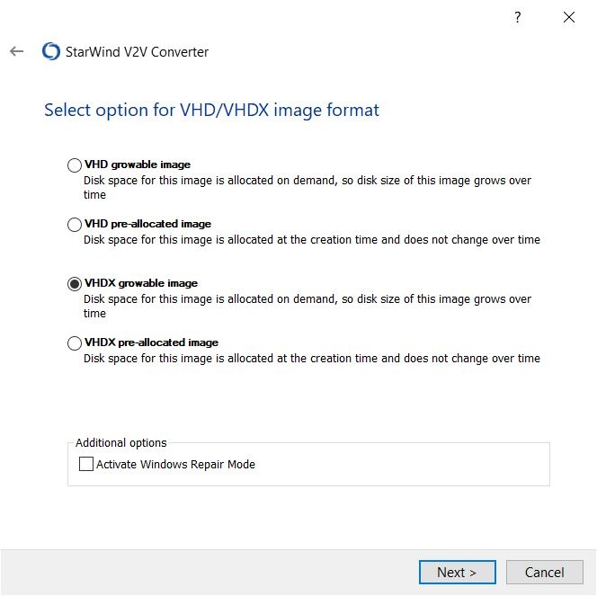

*Figure 8*: Select VHDX growable image as VHD/VHDX image format

  

  

5. Use Hyper-V New Virtual Machine Wizard (NOT Quick Create) and specified Generation  

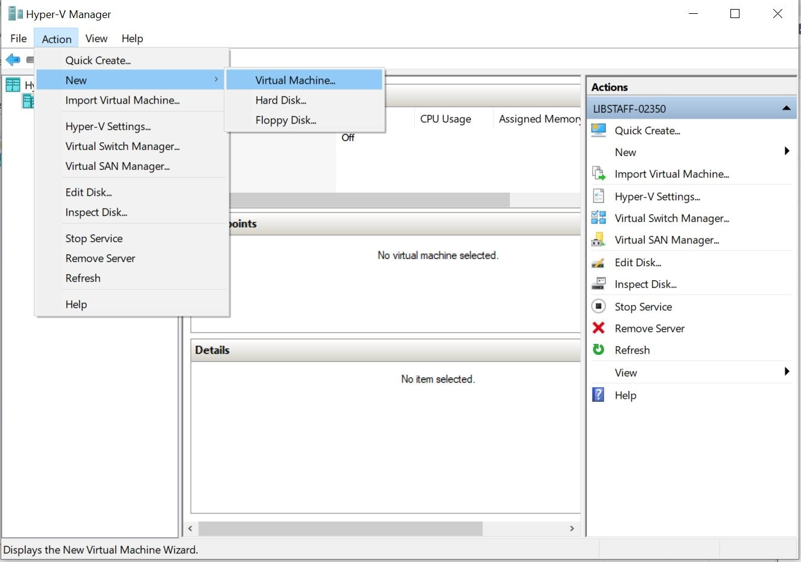

*Figure 9*: From the Action menu, navigate to New, and Virtual Machine

  

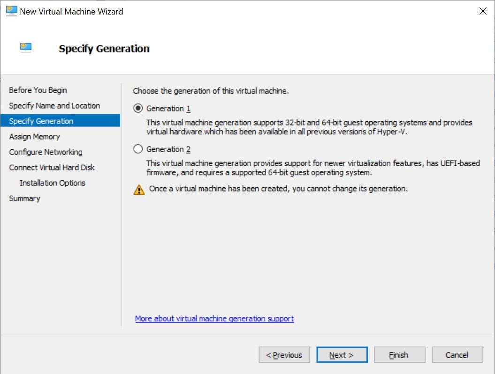

*Figure 10*: Within Specify Generation menu, choose the generation of the virtual machine

  

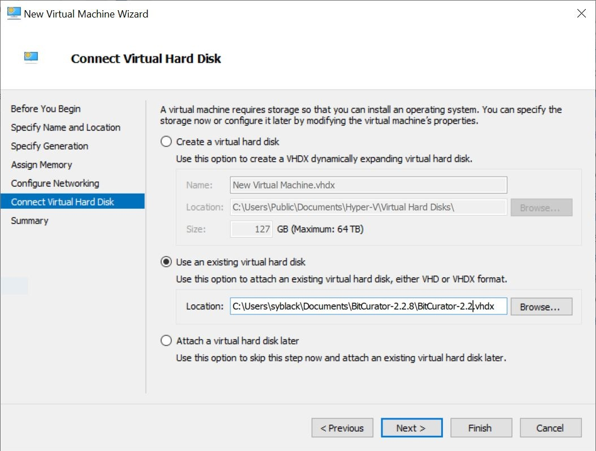

*Figure 11*: Within Connect Virtual Hard Disk menu, select "Use an existing virtual hard disk"

### Troubleshooting

* For addressing internet connectivity issues, create a [New Virtual Switch](https://docs.microsoft.com/en-us/windows-server/virtualization/hyper-v/get-started/create-a-virtual-switch-for-hyper-v-virtual-machines) if VM does not connect to the Default Switch used for other VMs.
* Potential errors when extracting ova file using 7zip
+ Converted to vhd growable image, but couldn’t open in Hyper-V when using Quick Create
+ Repeated above but extracted ova in Terminal, got similar error in Hyper-V, even with secure boot on or off

  

 If you would like to provide feedback for this page, please follow this [link to the BitCurator Wiki Google Form](https://docs.google.com/forms/d/e/1FAIpQLSeW9_Ri9tzXzisgBzQ26o4Ea4moDYmcKZ_f1qd9s4Ju17Yf_w/viewform?usp=sf_link) for the Installing BitCurator section.